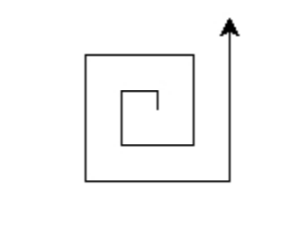
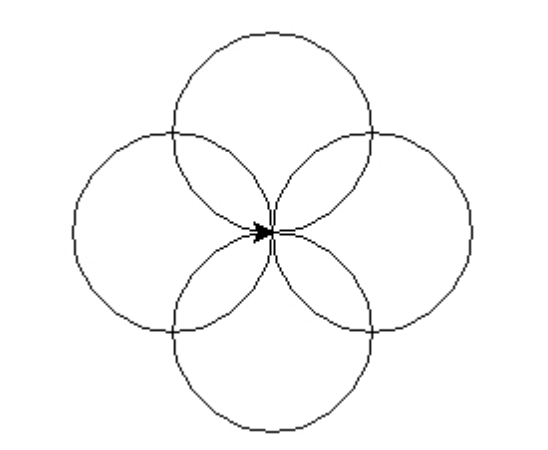

24年GESP 6月认证 Python一级真题解析(一选择题部分)  

**第 1 题** 小杨父母带他到某培训机构给他报名参加CCF组织的GESP认证考试的第1级，那他可以选择的认证语言有几
种？（ ）  
A. 1  
B. 2  
C. 3  
D. 4  

**答案**：**B**  
**解析**：  
GESP认证考试的语言包括：C++、Python、Scratch(图形化编程)三种。  

**第 2 题** ENIAC于1946年投入运行，是世界上第一台真正意义上的计算机，它的主要部件都是（ ）组成的。  
A. 感应线圈  
B. 电子管  
C. 晶体管  
D. 集成电路  

**答案**：**B**
**解析**：
ENIAC是世界上第一台真正意义上的计算机，它的主要部件都是电子管组成的。
知识扩展 现在我们用的计算机的主要部件是**集成电路**。

**第 3 题** 在Python中，假设N为正整数，则表达式 print(N % 3 + N % 7) 的最大值是( )。  
A. 最大值为6  
B. 最大值为8  
C. 最大值为9  
D. 最大值为10  
**答案**：**B**
**解析**：
N % 3 + N % 7 中"%" 是取余数的意思，所以N % 3 的取值范围是0-2，N % 7 的取值范围是0-6，所以N % 3 + N % 7 的最大值是8。
  
**第 4 题** Python语句 print(f"5%2={5%2}",5 % 2) 执行后的输出是( )。  
A. 1={1} 1  
B. 5%2={5%2}1  
C. 5%2={5%2} 1  
D. 5%2=1 1  
**答案**：**D**
**解析**：
题目中的print 有两个输入参数  
**第一个参数**是一个f-string，``f"5%2={5%2}"``在这里{5%2}是一个计算表达式，直接计算5%2=1， 其他的都是字符串直接显示，所以这部分显示为``5%2=1``  
**第二个参数**是一个数字计算表达式，5%2，直接计算，后将结果显示在第一个参数后面的位置  
所以最终的输出是``5%2=1 1``  

**第 5 题**执行Python语句 print(input()) 时如果输入5+2，下述说法正确的是（ ）。   
A. 将输出整数7  
B. 将输出5+2  
C. 语句执行将报错，函数不能作为函数的参数  
D. 语句执行将报错，因为input()函数的括号内没有提示字符串  
**答案**：**B**   
**解析**：  
input()函数的作用是接收用户输入的内容，返回的是一**个字符串**。所以当输入5+2时，输出的是5+2字符串。

**第 6 题** 下面Python代码执行后的输出是（ ）。

```python
a = 101.101
a = 101
print(f"a+1={a+1}")
```

A. 102={102}  
B. a+1={a+1}  
C. a+1=102  
D. a先被赋值为浮点数，后被赋值为整数，执行将报错  
**答案**：**C**  
**解析**：  
代码逐行解析
``` python
a = 101.101  #定义一个浮点数a=101.101
a = 101      #将a重新赋值为整数101
print(f"a+1={a+1}")  #{a+1} 计算后等于102 输入到f-string中，所以输出为a+1=102
```

**第 7 题** 下面Python代码执行后的输出是（ ）。

```python
a = "5"
b = 5
print(f"{a}+{b}")
```

A. 5+5  
B. 5+'5'  
C. 10  
D. 55  
**答案**：**A**  
**解析**：  
代码逐行解析  

``` python
a = "5"  #定义一个字符串a="5"
b = 5    #定义一个整数b=5
print(f"{a}+{b}")  #将a和b输入到f-string中，一个变量是字符串 一个变量是整数，f-string会自动将整数的变量按照字符串处理，所以输出为5+5
```

**第 8 题** 下面Python代码执行时输入10后，正确的输出是（ ）。  

```python
    N = int(input("请输入正整数："))
    if N % 3:
        print("第3行代码", N % 3, sep = "")
    else:
        print("第4行代码", N % 3, sep = "")

```

A. 第3行代码1  
B. 第4行代码1  
C. 第3行代码 1  
D. 第4行代码 1  
**答案**：**A**  
**解析**：  
代码逐行解析  

``` python
N = int(input("请输入正整数："))  #输入一个正整数N,这里输入10 转化成整数类型的N
#N%3的值为10%3=1 走if分支
if N % 3:  #判断N%3的值，如果N%3的值为真，即N%3的值不为0，执行下一行代码 
    print("第3行代码", N % 3, sep = "")  #输出第3行代码和N%3的值，N%3的值为10%3=1
    #注意这边有一个小细节 sep = "" 是指定输出的分隔符为空，所以输出的是第3行代码1 而不是第3行代码 1
else:  #如果N%3的值为0，执行下一行代码
    print("第4行代码", N % 3, sep = "")  #输出第4行代码和N%3的值，N%3的值为10%3=1
```

**第 9 题** 下面Python代码执行后，最终输出是（ ）。

```python
Sum = 0
for i in range(10):
    Sum += i
print(i,Sum)
```

A. 9 45  
B. 10 55  
C. 10 45  
D. 11 55  
**答案**：**A**    
**解析**：  
代码逐行解析  

``` python  
Sum = 0  #定义一个变量Sum=0
for i in range(10):  #循环10次，i的值从0到9
    Sum += i  #Sum = Sum + i
print(i,Sum)  #输出i和Sum的值，i的值是循环结束后的值，即9，Sum的值是0+1+2+3+4+5+6+7+8+9=45
```

扩展知识点：

- range(10) 生成的是0-9的整数序列

**第 10 题**   下面Python代码用于判断N是否为质数（只能被1和它本身整除的正整数）。程序执行后，下面有关描述错
误的是（ ）。  

``` python
N = int(input("请输入整数："))
Flag = False
if N >= 2:
    Flag = True
    for i in range(2,N):
        if N % i == 0:
            Flag = False
            break
if Flag == True:
    print("是质数")
else:
    print("不是质数")
```  

A. 如果输入负整数，将输出“不是质数”  
B. 如果输入2，将输出“是质数”，因为Flag已被改变为True  
C. 如果输入2，将输出“是质数”，即便此时循环体没有被执行  
D. 如果将 if N >= 2: 改为 if N > 2: 同样能正确判断N是否质数  

**答案**：**D**  
**解析**：  
质数：只能被1和它本身整除的正整数。   
如下求质数的算法是 任何一个正整数N，如果2到N-1之间的任意一个数都不能整除N，则N是质数。但凡能被2到N-1之间的任意一个数整除的数都不是质数。  

代码逐行解析  

``` python
N = int(input("请输入整数："))  #输入一个整数N
Flag = False  #定义一个变量Flag=False
if N >= 2:  #判断N是否大于等于2
    Flag = True  #如果N大于等于2，将Flag的值改为True
    for i in range(2,N):  #循环2到N-1
        if N % i == 0:  #如果N能被i整除
            Flag = False  #将Flag的值改为False
            break  #跳出循环
if Flag == True:  #判断Flag的值是否为True
    print("是质数")  #输出是质数
else:  #如果Flag的值不为True
    print("不是质数")  #输出不是质数
```

选项D中的if N > 2: 与 if N >= 2: 的区别是，前者不包含2，后者包含2，如果按照N>2来判断，当输入2时，将不会进入循环体，所以输出是“是质数”是错误的。

**第 11 题** 下面的Python代码用于求1-N之间所有奇数之和，其中N为正整数，如果N为奇数求和时包括N。有关描述错
误的是（ ）。

```python
N = int(input("请输入正整数："))
i = 1
Sum = 0
while i <= N:
    if i % 2 == 1:
        Sum += i
    i += 1
print(i,Sum)
```

A. 执行代码时如果输入10，则最后一行输出将是 11 25  
B. 执行代码时如果输入5，则最后一行输出将是 6 9  
C. 将 i += 1 移到 if i % 2 == 1: 前一行且同样对齐，同样能实现题目要求  
D. 删除 if i % 2 == 1: ，并将 i += 1 改为 i += 2 ，且将 Sum += i 与 i += 2 同样对齐，同样可以实现  
题目要求
答案：**C**    
本题求1-N之间所有奇数之和的算法是：从1到N，如果i是奇数，将i加到Sum上。  
逐行代码解析   

``` python
N = int(input("请输入正整数："))  #输入一个正整数N
i = 1  #定义一个变量i=1
Sum = 0  #定义一个变量Sum=0
while i <= N:  #当i小于等于N时执行循环
    if i % 2 == 1:  #判断i是否为奇数
        Sum += i  #如果i为奇数，将i加到Sum上
    i += 1  #i+1
print(i,Sum)  #输出i和Sum的值
```

选项C中的将 i += 1 移到 if i % 2 == 1: 前一行且同样对齐，不能实现功能，第一次执行的1 将丢失 直接执行2，所以输出是错误的。

选项D的代码如下：

``` python
N = int(input("请输入正整数："))  #输入一个正整数N
i = 1  #定义一个变量i=1
Sum = 0  #定义一个变量Sum=0
while i <= N:  #当i小于等于N时执行循环
    Sum += i  #将i加到Sum上
    i += 2  #i+2
print(i,Sum)  #输出i和Sum的值
```

``编程的思想``：直接将所有的奇数加到Sum上，不需要判断i是否为奇数，所以选项D是正确的。

**第 12 题** 下面Python代码执行后的描述，正确的是（ ）。

```python
import turtle
for i in range(1,10,2):
    if i % 3 == 0:
        turtle.pencolor("red")
    else:
        turtle.pencolor("blue")
    turtle.forward(50)
```

A. 共有5条线段，蓝红相间，即蓝红蓝红蓝  
B. 共有3条线段，全部是蓝色，看起来是1条线段  
C. 共有6条线段，其中两条红色线段，4条蓝色线段  
D. 以上说法都不正确  
**答案**：**D**  
**解析**：  
代码逐行解析 

``` python  
import turtle  #导入turtle模块
for i in range(1,10,2):  #循环1到9，步长为2
    if i % 3 == 0:  #判断i是否能被3整除
        turtle.pencolor("red")  #如果i能被3整除，将画笔颜色改为红色
    else:  #如果i不能被3整除
        turtle.pencolor("blue")  #将画笔颜色改为蓝色
    turtle.forward(50)  #画一条50像素的线段
```

根据上面代码可以得到线段  
i=1 画一条蓝色线段  
i=3 画一条红色线段  
i=5 画一条蓝色线段  
i=7 画一条蓝色线段  
i=9 画一条红色线段  
所以选项A、B、C都是错误的。

**第 13 题** 下面Python代码执行后的描述，错误的是（ ）。

```python
import turtle
turtle.circle(100)
turtle.circle(100, 360, 8)
turtle.circle(100, 180, 4)
```

A. 代码 turtle.circle(100) 将绘制一个半径为100的圆  
B. 代码 turtle.circle(100, 360, 8) 将绘制半径为100的完整内接正八边形  
C. 代码 turtle.circle(100, 360, 8) 将绘制半径为100的宽度为8的圆  
D. 代码 turtle.circle(100, 180, 4) 将绘制半径为100的正八边形的右侧一半（4条边）, 因为 第2个参数是
180度（只绘制一半）且第3个参数为4（只绘制出4个边）。  
**答案**：**C**  
**解析**：  
turtle.circle函数的参数解析
turtle.circle(radius, extent=None, steps=None)

- radius：半径
- extent：弧度，如果不填写，将绘制一个完整的圆
- steps：绘制多边形，如果不填写，将绘制一个完整的圆 如果填写了，将绘制一个多边形

代码逐行解析

``` python
import turtle  #导入turtle模块
turtle.circle(100)  #绘制一个半径为100的圆
turtle.circle(100, 360, 8)  #绘制半径为100的完整内接正八边形
turtle.circle(100, 180, 4)  #绘制半径为100的正八边形的右侧一半（4条边）
```

选项C中的代码turtle.circle(100, 360, 8) 将绘制半径为100的完整内接正八边形，所以选项C是错误的。

**第 14 题** 下面Python代码执行后输出的图形如下，横线处应填写的代码是（ ）。


```
import turtle
for d in range(10,_______,10):
    turtle.left(90)
    turtle.forward(d)
```

A. 120  
B. 110  
C. 100  
D. 90  

**答案**：**C**
**解析**：
代码逐行解析

``` python
import turtle  #导入turtle模块
for d in range(10,X,10):  #循环10到90，步长为10
    turtle.left(90)  #左转90度
    turtle.forward(d)  #画一条d长度的线段
```

这个题就是看图数线段，图像中有9条线段，所以X的值为100，所以选项C是正确的。

**第 15 题** 为画出如下所示图形，下面Python代码横线处应填入( )。


```python
import turtle
for i in range(4):
turtle.circle(50)
turtle.left(__________)
```

A. 360  
B. 180  
C. 90  
D. 45  
答案：**C**
解析：
代码逐行解析

``` python
import turtle  #导入turtle模块
for i in range(4):  #循环4次
    turtle.circle(50)  #绘制一个半径为50的圆
    turtle.left(？)  #左转？度
```

观察图像，每次绘制一个圆后，都要左转90度，所以填入90，所以选项C是正确的。
