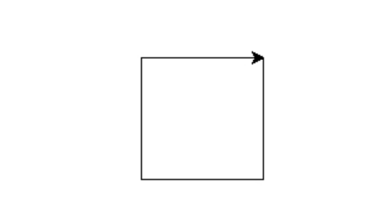
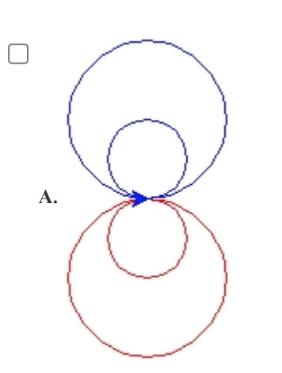
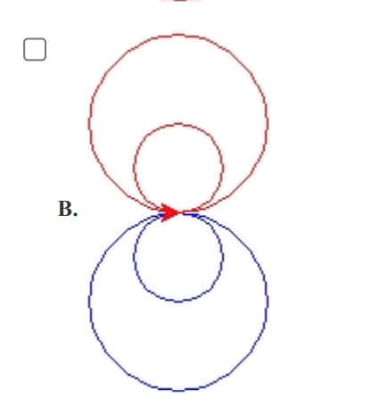
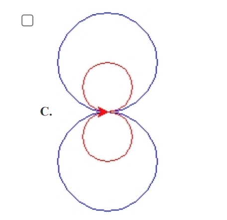
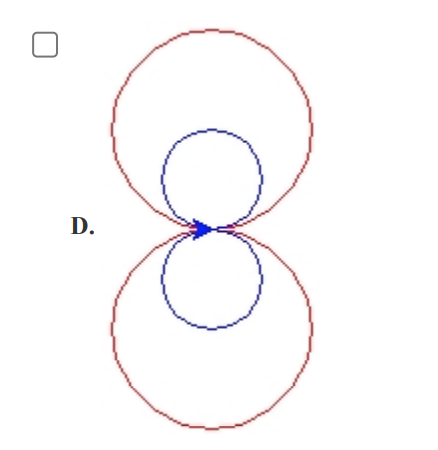

24年GESP 9月认证 Python一级真题解析(一选择题部分)  

**第 1 题** 据有关资料，山东大学于1972年研制成功DJL-1计算机，并于1973年投入运行，其综合性能居当时全国第三
位。DJL-1计算机运算控制部分所使用的磁心存储元件由磁心颗粒组成，设计存贮周期为2μs（微秒）。那么该磁心
存储元件相当于现代计算机的（ ）。  
A. 内存  
B. 磁盘  
C. CPU  
D. 显示器  

**答案**：**A**  
**解析**：  
DJL-1计算机运算控制部分所使用的磁心存储元件相当于现代计算机的内存。  

**第 2 题** Python程序执行出现错误，不太常见的调试手段是（ ）。  
A. 阅读源代码  
B. 单步调试  
C. 输出执行中间结果  
D. 跟踪计算机执行的底层代码（如二进制机器码，汇编码）  

**答案**：**D**  
**解析**：  
Python程序执行出现错误，常见的调试手段有：阅读源代码、单步调试、输出执行中间结果。  
不太常见的调试手段是跟踪计算机执行的底层代码（如二进制机器码，汇编码）。  
计算机的底层代码是机器码，汇编码，对于一般的Python程序员来说，看不懂，也不需要看。  

**第 3 题** 在Python中，下列表达式错误的是( )。  
A. print("Hello,GESP!")  
B. print('Hello,GESP!')  
C. print("""Hello,GESP!""")  
D. print("Hello,GESP!')  

**答案**：**D**  
**解析**：  
在Python中，字符串可以使用单引号、双引号、三引号表示，但是引号必须成对出现，所以print("Hello,GESP!')是错误的。  
选择C是正确的，**三引号字符串**来打印文本时，它会按照你输入的原样输出，包括换行符（如果你在三引号字符串内部添加了换行符的话）。

**第 4 题** Python表达式 10 - 3 * 2 的值是( )。  
A. 14  
B. 4  
C. 1  
D. 0  

**答案**：**B**  
**解析**：  
Python表达式``10 - 3 * 2``的值是``4``。  

**第 5 题** 在Python中，假设N为正整数10，则 print(N // 3 + N % 3) 将输出( )。  
A. 6  
B. 4.3  
C. 4  
D. 2  

**答案**：**C**  
**解析**：  
N // 3  中"//" 是整除的意思，所以10 // 3 的值是3，  
N % 3 中"%" 是取余数的意思，所以10 % 3 的值是1，  
所以 print(N // 3 + N % 3) 的值是4。  

**第 6 题** Python语句 print(f"6%2={6%2}") 执行后的输出是( )。  
A. f"6%2={6%2}"  
B. 6%2={6%2}  
C. 0=0  
D. 6%2=0  

**答案**：**D**  
**解析**：  
Python语句``print(f"6%2={6%2}")``中的f-string，{6%2}是一个计算表达式，直接计算6%2=0，其他的都是字符串直接显示，所以这部分显示为``6%2=0``。  

**第 7 题** 执行下面的Python代码，先后从键盘上输入5回车和2回车，输出是（ ）。  

```python
a = input()
b = input()
print(a + b)
```

A. 将输出整数7  
B. 将输出52，5和2之间没有空格  
C. 将输出5和2，5和2之间有空格  
D. 语句执行将报错，因为input()函数的括号内没有提示字符串  
**答案**：**B**  
**解析**：  
Python中的input()函数的作用是接收用户输入的内容，返回的是一个字符串。a和b分别是两个字符串，所以print(a + b)的输出是52，5和2之间没有空格。  

**第 8 题** 下面Python代码执行后，相关说法错误的是（ ）。  

```python  
N = input()
N = int(N)
print(N % 10)
```

A. 如果N是小于10的正整数，则输出0  
B. 如果N是大于等于0的整数，则输出N的个位数【N的最后一位数】  
C. 如果N是负整数，则输出不是N的个位数【N的最后一位数】  
D. 如果N是大于10的正整数，则输出N的个位数【N的最后一位数】  
**答案**：**A**  
**解析**：  
Python代码执行后，N是一个整数，N % 10 是取N的个位数，如果N是小于10的正整数，则输出是N  
所以说法A是错误的。  
选项C 如果N是负整数，N % 10 假设N是-12，-12 % 10 = 8，所以C的说法是正确的。  
>在计算机中，特别是使用Python这样的编程语言时，-9 除以 10 的结果之所以与算术中的直观理解有所不同，主要是因为计算机和编程语言遵循了特定的数学规则和约定，特别是关于整数除法和浮点除法的处理方式。

**第 9 题** 下面Python代码执行后，相关说法错误的是（ ）。  

```python
N = input()
N = int(N)
if N < 0:
    print(-N)
else:
    print(N)
```

A. 如果输入正整数、负整数或0，输出都将是大于等于0的数，即其绝对值  
B. 如果输入正浮点数、负浮点数或0，输出都将是大于等于0的浮点数，即其绝对值  
C. 如果输入正浮点数或负浮点数，程序将报错  
D. 如果输入形如5+2类似的表达式，程序将报错  

**答案**：**B**  
**解析**：  
Python代码执行后，假如输入的N是整数，则输出是大于等于0的数，即其绝对值。  
假如N是一个浮点数，在进行int(N)转换时，会报错，int()函数转化字符串为整数时，字符串必须是整数字符串，不能是浮点数字符串。  
所以选项B是错误的。  

**第 10 题** 下面Python代码执行后输出是（ ）。  

```python
Sum = 0
for i in range(10):
    Sum += i
print(Sum)

```

A. 55  
B. 45  
C. 10  
D. 9  
**答案**：**B**  
**解析**：  
Python代码执行后，Sum = 0，然后for循环遍历0到9，Sum += i，所以输出是0+1+2+3+4+5+6+7+8+9=45。  

**第 11 题** 下面Python代码执行后输出的是（ ）。  

```python
N = 0
for i in range(10):
    N += 1
print(N)
```

A. 55
B. 45
C. 10
D. 9

**答案**：**C**  
**解析**：  
这段Python是统计for循环的次数。  
Python代码执行后，N = 0，然后for循环遍历0到9，N += 1，所以输出是10。  

**第 12 题** 下面Python代码执行后输出的是（ ）。  

```python
N = 0
for i in range(1, 10, 2):
    if i % 2 == 1:
        continue
    N += 1
print(N)

```

A. 5  
B. 4  
C. 2  
D. 0  

**答案**：**D**  
**解析**：  
Python代码执行后，N = 0，然后for循环遍历1到9，步长为2，  
i % 2 == 1，continue,下一个循环，
i % 2 != 1，N += 1,  
程序中i 执行的值是1，3，5，7，9，所以输出是0。

**第 13 题** 为在Python Turtle中输出如下图形，代码横线处应填入（ ）。  



```python

import turtle
for i in range(1,5):
    turtle._________
    turtle.forward(100)
```

A. right(90)  
B. left(90)  
C. right(-90)  
D. left(-180)  

**答案**：**A**  
**解析**：  
观察题中的图形，是一个正方形，最后箭头的方向是向右的，所以第一条边应该是向右转90度，所以填入right(90)。

**第 14 题** 下面Python执行后，有关说法，正确的是（ ）。  

```python
import turtle
for i in range(10):
    if i % 2 == 0:
        turtle.color("red")
    else:
        turtle.color("blue")
    turtle.forward(20+i*5)  

```

A. 以红色线段开始，长度为20  
B. 以红色线段开始，长度为25  
C. 以蓝色线段开始，长度为20  
D. 以蓝色线段开始，长度为25  

**答案**：**A**  

**解析**：  
Python代码执行后，for循环遍历0到9，i % 2 == 0，当i=0 时，turtle.color("red")，所以以红色线段开始，长度为20+i*5=20。所以选项A是正确的。

**第 15 题** 下面Python代码执行后输出的是（ ）。  

```python
import turtle
for i in range(4):
    turtle.left(180)
    if i % 2 == 0:
        turtle.color("red")
    else:
        turtle.color("blue")
    if i < 2:
        turtle.circle(25)
    else:
        turtle.circle(50)
```






**答案**：**A**  
**解析**：  
上面的Python代码解释如下  

1. for循环遍历0到3，turtle.left(180)是向左转180度。  
2. i % 2 == 0，余数为0，turtle.color("red")，余数非0，turtle.color("blue")。  
3. if i < 2:，i小于2，turtle.circle(25)，i大于等于2，turtle.circle(50)。  

运行情况如下：  
i=0，箭头向左，在下方画的是红色的小圆形。  
i=1，箭头向右，在上方画的是蓝色的小圆形。  
i=2，箭头向左，在下方画的是红色的大圆形。  
i=3，箭头向右，在上方画的是蓝色的大圆形。  

所以选项A是正确的。  
