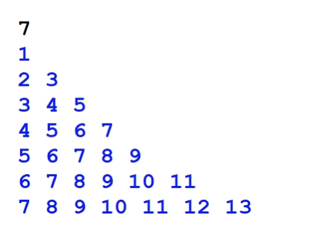

24年GESP 9月认证 Python二级真题解析(一选择题部分)  

**第 1 题** 据有关资料，山东大学于1972年研制成功DJL-1计算机，并于1973年投入运行，其综合性能居当时全国第三
位。DJL-1计算机运算控制部分所使用的磁心存储元件由磁心颗粒组成，设计存贮周期为2μs（微秒）。那么该磁心
存储元件相当于现代计算机的（ ）。  
A. 内存  
B. 磁盘  
C. CPU  
D. 显示器  

**答案**：**A**  
**解析**：  
DJL-1计算机运算控制部分所使用的磁心存储元件相当于现代计算机的内存。  

**第 2 题** Python程序执行出现错误，不太常见的调试手段是（ ）。  
A. 阅读源代码  
B. 单步调试  
C. 输出执行中间结果  
D. 跟踪计算机执行的底层代码（如二进制机器码，汇编码）  

**答案**：**D**  
**解析**：  
Python程序执行出现错误，常见的调试手段有：阅读源代码、单步调试、输出执行中间结果。  
不太常见的调试手段是跟踪计算机执行的底层代码（如二进制机器码，汇编码）。  
计算机的底层代码是机器码，汇编码，对于一般的Python程序员来说，看不懂，也不需要看。  

**第 3 题** 在Python中，下列不可做变量的是( )。  
A. ccf-gesp  
B. ccf_gesp  
C. ccfGesp  
D._ccfGesp  

**答案**：**A**  
**解析**：
在Python中，变量名只能包含字母、数字和下划线。变量名可以字母或下划线开头，但不能以数字开头。  
因此，ccf-gesp是错误的，其他选项都是正确的。

**第 4 题**  在Python中，与 range(1, 10) 效果相同的是( )。  
A. range(10)  
B. range(11)  
C. range(1, 10, 1)  
D. range(0, 10, 1)  

**答案**：**C**  
**解析**：  
range(1, 10) 生成1到9的整数，range(1, 10, 1) 生成1到9的整数，步长为1，所以与range(1, 10) 效果相同。

**第 5 题** 在Python中， print(5 // 2 + 5 % 3) 的输出是( )。  
A. 1  
B. 2  
C. 4  
D. 5  

**答案**：**C**  
**解析**：  
``5 // 2`` 是整除，结果是2，``5 % 3`` 是 取余数，结果是2，所以 print(5 // 2 + 5 % 3) 的输出是4。

**第 6 题** 下面Python代码执行时先后输入2和3.14后，其输出是( )。

```python
a = input()
b = input()
print(a + b)
```

A. 5  
B. 23.14  
C. 5.14  
D. 将触发异常

**答案**：**B**  
**解析**：  
input()函数接收的是字符串类型，所以a和b都是字符串类型，所以print(a + b)是字符串拼接，输出23.14。

**第 7 题** 在Python代码中假设N为正整数，则下面代码能获得个位数的是（ ）。

A. N % 10  
B. N // 10  
C. N / 10  
D. 以上选项均不正确  

**答案**：**A**  
**解析**：  
N % 10 是取N的个位数，N // 10 是取N的十位数，N / 10 是除法运算，结果是浮点数，  
所以N % 10 能获得个位数。选择A。

**第 8 题** 下面Python代码执行后的输出是（ ）。

```python
for i in range(10):
    if i % 2:
        break
    print("0", end = "#")
else:
    print("1",end = "#")

```

A. 0  
B. 0#  
C. 0#0#1  
D. 没有输出  

**答案**：**B**  
**解析**：  
for循环遍历0到9，i % 2 是判断i是否为奇数，当i为奇数时，执行break语句，提前终止循环，  
所以循环只执行了i=0后，输出"0#"。再执行i=1 break退出循环。

**第 9 题** 执行下面Python代码并输入1和0，输出是（ ）。

```python
a = int(input())
b = int(input())
if a and b:
    print("1")
elif not (a or b):
    print("2")
elif a or b:
    print("3")
else:
    print("4")
```

A. 1  
B. 2  
C. 3  
D. 4  

**答案**：**C**  
**解析**：  
a和b输入一个是1，一个是0，所以a为True b为False，
``a and b`` 为False，``not (a or b)`` 为False，``a or b`` 为True，所以输出是3。

**第 10 题** 下面Python代码执行后的输出是（ ）。  

```python
loopCount = 0
for i in range(1, 5, 2):
    loopCount += 1
print(loopCount) 
```

A. 1  
B. 2  
C. 3  
D. 5  

**答案**：**B**  
**解析**：  
for循环遍历1到4，步长为2，所以输出是1、3，循环次数是2次，所以输出是2。

**第 11 题** 下图是Python程序执行后的输出。为实现其功能，横线处应填入代码是（ ）。


``` python
lineNum = int(input())
for i in range(1, lineNum + 1):
    for j in range(____________):
        print(j, end = " ")
    print()
```

A. i, i  
B. 1, i  
C. i, i*2  
D. i+1, i + i  

**答案**：**C**  
**解析**：
外层循环i从1到lineNum，内层循环j从i到``i*2``，所以填入代码是i, ``i*2``。

**第 12 题** 下面Python代码执行后输出逆序数，如输入123则输出321。如输入120则输出21。横线处先后应填入的代码
是（ ） 。

```python
N = int(input())
rst = 0
while N:
    ____________________
    ______________________
print(rst)

```

A. ``rst = rst *10 + N % 10``  
    ``N = N // 10``  
B. ``rst += N % 10``  
   `` N = N // 10 ``  
C. ``rst = rst* 10 + N % 10``  
   ``N = N / 10``
D. ``rst += N % 10``
   ``N = N / 10``  

**答案**：**A**  
**解析**：  
逆序数，如输入123则输出321。如输入120则输出21。  
根据题意的算法：

1. 循环处理N的个位数，
    * 1.1 逐一处理N的个位数，将rst的数字扩大一位，并将``个位数``添加到rst的末尾.  
    * 1.2 同时将N的个位数去掉。
2. 直到N为0，结束循环。  

所以填入代码是rst = rst*10 + N % 10 和 N = N // 10。

**第 13 题** 下面的Python代码用于输入学生成绩，并根据人数计算出平均成绩，有关说法错误的是（ ）。

```python
Sum = 0 #保存总成绩
cnt = 0 #保存学生人数
while True:
    score = int(input())
    if score < 0:
        break
    cnt += 1
    Sum += score
print(f"总学生数：{cnt}，平均：{Sum/cnt}")

```

A. 代码 while True: 写法错误  
B. 如果输入负数，将结束输入，并正确输出  
C. 如果录入的学生成绩含有小数，程序将报错  
D. 以上说法都没有错误  

**答案**：**A**  
**解析**：
代码 while True: 写法是正确的，表示无限循环。

**第 14 题** 请在横线上填写代码。以下Python代码判断输⼊的数是否为质数，如果该数字是质数，则输出YES，否则输
出NO。质数是指仅能被1和它本身整除的正整数（ ）。

```python
num = int(input())
for i in range(2,num):
    if __________:
        print("NO")
        break
    else:
        print("YES")
```

A. num % i  
B. num % i == 0  
C. num // i  
D. num // i == 0

**答案**：**B**
**解析**：
质数是指仅能被1和它本身整除的正整数。 根据代码逻辑，如果num % i == 0，说明num能被i整除，num不是质数，输出NO。
所以填入代码是num % i == 0。

**第 15 题** 一个数如果能被某个小于10的正整数（比如7）整除，或者含有该数，则说该数是某个数的相关数。下面
Python代码用于判断输入的数与7是否有关。其说法错误的是（ ）。

```python
N = int(input())
Flag = False
M = N
if M % 7 == 0:
    Flag = True
while Flag == False and M != 0:
    if M % 10 == 7:
        Flag = True
        break
    M //= 10
if Flag == True:
    print(f"{N}与7有关")
else:
    print(f"{N}与7无关")
```

A. 删除break语句将导致死循环  
B. 删除 M //= 10 将可能导致死循环  
C. 删除 M = N 并将其后代码中的M变量改为N，同样能完成相关功能，但输出形式有所不同  
D. 删除break语句不会导致死循环，但有时会影响效率  

**答案**：**A**
**解析**：
A选项是错误的，删除break语句后, M//=10 会一直执行，直到M为0，会结束循环，但不会死循环.
