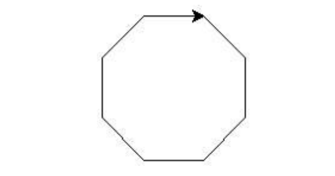

24年GESP 12月认证 Python一级真题解析(一选择题部分)  

**第 1 题** 2024年10⽉8⽇ ，诺贝尔物理学奖“意外地”颁给了两位计算机科学家约翰·霍普菲尔德（John J. Hopfield）和杰弗⾥·⾟顿（Geoffrey E. Hinton） 。这两位科学家的主要研究⽅向是（ ）。  
A. 天体物理  
B. 流体⼒学  
C. ⼈⼯智能  
D. 量⼦理论  

**答案**：**C**  
**解析**：  
ABCD选项中，只有C是和计算机相关的，且约翰·霍普菲尔德和杰弗里·辛顿是计算机科学家，主要研究方向是人工智能。

**第 2 题** 下列软件中是操作系统的是（ ）。  
A. ⾼德地图  
B. 腾讯会议  
C. 纯⾎鸿蒙  
D. ⾦⼭永中  

**答案**：**C**  
**解析**：  
ABCD选项中，只有C是操作系统，其他的都是应用软件。  

**第 3 题** 有关下列Python代码的说法 ，错误的是( )。  

```python
print("Hello,GESP!")
```

A. 配对双引号内 ，不可以有汉字  
B. 配对双引号可以相应改变为英⽂单引号  
C. 配对双引号可以相应改变为三个连续英⽂单引号  
D. 配对双引号可以相应改变为三个连续英⽂双引号  

**答案**：**A**  
**解析**：  
Python中字符串可以使用单引号、双引号、三引号表示，但是引号必须成对出现，BCD选项都正确。  
A选项中，配对双引号内，可以有汉字。A选项是错误的。

**第 4 题** Python表达式 20 - 3 * 2 ** 2 的值是( )。  
A. -16  
B. 8  
C. 68  
D. 196  

**答案**：**B**  
**解析**：  
Python表达式 $20 - 3 *2 **2$ 的值是 $20 - 3* 4$ = $20 - 12$ = 8。  
**优先级**：幂运算符** > 乘法和除法 > 加法和减法。

**第 5 题** 在Python中 ，假设N为正整数2 ，则 print(N // 3 + N % 3) 将输出( )。  
A. 0  
B. 2  
C. 3  
D. 4  

**答案**：**B**  
**解析**：  
N // 3 中"//" 是整除的意思，所以2 // 3 的值是0，  
N % 3 中"%" 是取余数的意思，所以2 % 3 的值是2，  
所以 print(N // 3 + N % 3) 的值是2。

**第 6 题** Python语句 print(7%3,"7%3",f"7%3={7%3}") 执⾏后的输出是( )。  
A. 1 7%3 7%3={7%3}  
B. 1 7%3 1=1  
C. 1 1 1=1  
D. 1 7%3 7%3= 1  

**答案**：**D**  
**解析**：  
Python语句 print(7%3,"7%3",f"7%3={7%3}") 中  
第一个7%3是计算表达式，直接计算7%3=1，显示 1  
第二个"7%3"是字符串直接显示，  
第三个f"7%3={7%3}"是f-string，{7%3}是一个计算表达式，直接计算7%3=1，整体显示 7%3=1。  
所以输出是1 7%3 7%3=1。  

**第 7 题** 执⾏下⾯的Python代码 ，在键盘上输⼊123并回车 ，输出是（ ）。  

```python
a = input("请输入正整数： ")
print(a + "123")
```

A. 246  
B. 123123  
C. 123 123  
D. 语句执⾏将报错， 因为a是正整数不能和字符串相加  
**答案**：**B**  
**解析**：  
Python中的input()函数的作用是接收用户输入的内容，返回的是一个字符串。  
a是一个字符串，所以print(a + "123")的输出是123123。

**第 8 题** 有关下列Python代码的说法 ，错误的是（ ）。  

```python  
N = int(input())
print(N % 2)
```

A. input()函数不能放在int()函数之中  
B. 执⾏代码并在键盘上输⼊3. 14后回车 ，将报错  
C. 执⾏代码并在键盘上输⼊偶数 ，不管是负偶数还是正偶数 ，输出都是0  
D. 在Python中 ，input()函数内可以没有提⽰信息， 因此上述代码没有语法错误  
**答案**：**A**  
**解析**：  
Python中的input()函数可以放在int()函数之中，input()函数返回的是一个字符串，int()函数将字符串转化为整数。  
A选项是错误的。

**第 9 题** 下⾯Python代码执⾏后 ，求出⼏天后星期⼏ 。如果星期⽇则输出“星期天”否则输出形如“星期1” 。横线上应填⼊的代码是（ ）。  

```python

nowDay = int(input("今天星期几？ "))
afterDays = int(input("求几天后星期几？ "))
N = nowDay+afterDays
if ________:
    print("星期天")
else:
    print(f"星期{N%7}")
```

A. N % 7 != 0  
B. N % 7 == 0  
C. N == 0  
D. N % 7  

**答案**：**B**  
**解析**：  
这一题考查的是星期日的判断。  
星期日是星期7，所以星期日的判断是N % 7 == 0，所以填入B。

**第 10 题** 下⾯Python代码执⾏后输出是（ ）。  

```python
N = 0
for i in range(1, 10):
    N += 1
print(N + i)

```

A. 54  
B. 20  
C. 19  
D. 18  
**答案**：**D**  
**解析**：  
Python代码执行后，N = 0，然后for循环遍历1到9，N += 1，所以N = 9。
print(N + i)中i是for循环的最后一个值，所以i = 9，所以输出是9 + 9 = 18。  

**第 11 题** 下面Python代码执行后输出的是（ ）。  

```python
tnt = 0
for i in range(0, 100):
    tnt += i % 10
print(tnt)  
```

A. 4950  
B. 5050  
C. 450  
D. 100  

**答案**：**C**  
**解析**：  
Python代码执行后，tnt = 0，然后for循环遍历0到99，i % 10 是取i的个位数，  
所以tnt += i % 10，是将0到99的个位数相加，所以输出是450。  

**第 12 题** 下⾯Python代码执⾏后输出的是（ ）。  

```python
tnt = 0
for i in range(5, 100, 5):
    if i % 2 == 0:
        continue
    tnt += 1
    if i >= 50:
        break
print(tnt)

```

A. 10  
B. 9  
C. 6  
D. 5  

**答案**：**C**  
**解析**：  
Python代码执行后，tnt = 0，然后for循环遍历5到100，步长为5，    d
if i % 2 == 0: 是判断i是否为偶数，如果是偶数，continue，不执行后面的语句。  
否则 tnt += 1 ，tnt加1。  
if i >= 50: 是判断i是否大于等于50，如果大于等于50，break，跳出循环。  
所以5，15，25，35，45，55 这6个数都是奇数，所以tnt = 6。  
最后一个55大于等于50，所以break，所以循环结束。

**第 13 题** 为在Python Turtle中输出如下图形 ，代码横线处应填⼊（ ）。  



```python

import turtle
for i in range( ):
    turtle.right(45)
    turtle.forward(50)
```

A. 1, 8  
B. 9  
C. 1, 9  
D. 10  

**答案**：**C**  
**解析**：  
观察题中的图形，是一个正八边形，所以for循环的次数是8次，所以填入1, 9。

**第 14 题** 为在Python Turtle中输出如下图形 ，代码横线处应填⼊（ ）。  


```python
import turtle
for i in range( ):
    turtle.right(60)
    turtle.forward(50) 

```

A. 6  
B. 7  
C. 11  
D. 12  

**答案**：**B**  

**解析**：
观察题中的图形，是一个正六边形，所以for循环的次数是6次，所以填入7。  

**第 15 题** 为在Python Turtle中输出如下图形 ，代码横线处应填⼊（ ）。  


```python
import turtle
for i in range( ):
    turtle.right(120)
    turtle.forward(50)
    if i % 3 == 0:
        turtle.penup()
        turtle.forward(50)
        turtle.pendown()
```

A. 18  
B. 1, 19  
C. 19  
D. 20  

**答案**：**B**  
**解析**：  
观察题中的图形，是6个正三角形,所以for循环的次数是18次，同时第一步i = 1，所以填入1, 19。
