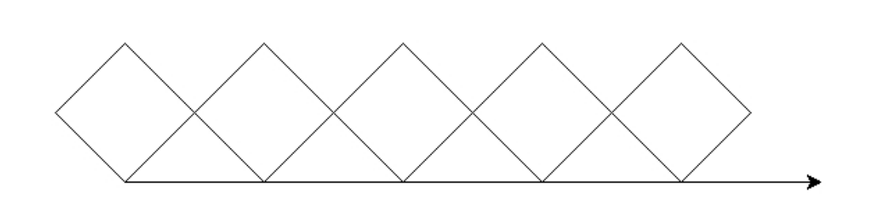

24年GESP 3月认证 Python一级真题解析(一选择题部分)  

**第 1 题** 小杨的父母最近刚刚给他买了一块华为手表，他说手表上跑的是鸿蒙，这个鸿蒙是？（ ）  
A. 小程序  
B. 计时器  
C. 操作系统  
D. 神话人物  

**答案**：**C**  
**解析**：  
鸿蒙是华为自主研发的操作系统。

**第 2 题** 中国计算机学会（CCF）在2024年1月27日的颁奖典礼上颁布了王选奖，王选先生的重大贡献是（ ）。  
A. 制造自动驾驶汽车  
B. 创立培训学校  
C. 发明汉字激光照排系统  
D. 成立方正公司  

**答案**：**C**  
**解析**：
王选先生的重大贡献是发明汉字激光照排系统。

**第 3 题** Python表达式 $(3 - 2) *3 + 5$ 的值是( )。  
A. -13  
B. 8
C. 2  
D. 0  
**答案**：**B**  
**解析**：
(3 - 2)*3 + 5 = 1* 3 + 5 = 3 + 5 = 8

**第 4 题** Python语句 print("5%2=",5 % 2) 执行后的输出是( )。  
A. 2 2  
B. 1 1  
C. 5%2=2  
D. 5%2= 1  
**答案**：**D**  
**解析**：
print("5%2=",5 % 2) 第一个参数是字符串，第二个参数是5 % 2的值，5 % 2 = 1

**第 5 题** 执行Python语句 a = input() 时如果输入 5+2 ，下述说法正确的是（ ）。  
A. 变量 a 将被赋值为整数7  
B. 变量 a 将被赋值为字符串，字符串内容为 5+2  
C. 语句执行将报错，不能输入表达式
D. 语句执行将报错，因为 input() 函数的括号内没有提示字符串作为参数  
**答案**：**B**  
**解析**：  
input() 函数接收用户输入，返回字符串类型，所以变量 a 将被赋值为字符串，字符串内容为 5+2  
**选项A**是错误的，因为input()函数返回的是字符串，不是整数  
**选项C**是错误的，因为input()函数可以接收表达式  
**选项D**是错误的，因为input()函数的括号内可以为空  

**第 6 题** 下面Python代码执行后的输出是（ ）

```python
a = 1 
print(f'a+1={a+1}')
```

A. a+1= 2  
B. a+1=2  
C. 2=2  
D. 2= 2  
**答案**：**B**  
**解析**：  
**f-string** 是 Python3.6版本新增的一种字符串格式化方法，**f-string** 以 f 或 F 开头，后面跟着字符串，字符串中的表达式用大括号 {} 包含起来，表达式会被计算，然后输出结果。  
**选项A**是错误的，因为a+1=2中间有空格  
**选择B**是正确的，因为a+1=2中间没有空格。  

**第 7 题** 下面Python代码执行时输入21后，有关描述正确的是（ ）。  

```python
1  N = int(input())
2  
3 if N % 3 == 0:  
4    print("能被3整除")
5 elif N % 7 == 0:
6    print("能被7整除")
7 else:
8    print("不能被3或7整除")
```

A. 仅有代码4行被执行  
B. 第4和第7行代码都被执行  
C. 仅有代码第7行被执行  
D. 第8行代码将被执行，因为 input() 输入为字符串  

**答案**：**A**  
**解析**：  
输入21，21 % 3 = 0，所以执行第4行代码，输出"能被3整除"

**第 8 题** 下面Python代码第2行，总共被执行次数是（ ）。  

```python
1  for i in range(-10, 10):   
2      print(i)
```

A. 0  
B. 10  
C. 19  
D. 20  
**答案**：**D**  
**解析**：
range(-10, 10) 生成-10到9的整数，总共有20个整数，所以执行20次

**第 9 题** 下面Python代码执行后的输出是（ ）。

```python
tnt = 0 #保存累加的和
for i in range(10):  
    if i % 3 and i % 7:  
        tnt += i
print(tnt）
```

A. 0  
B. 7  
C. 18  
D. 20  
**答案**：**D**  
**解析**：  
``i % 3 and i % 7`` 等价于``i % 3 != 0 and i % 7 != 0``，即i不能被3整除且不能被7整除，所以``i % 3 and i % 7``为True，所以tnt的值为``0+1+2+4+5+8=20``

**第 10 题** 下面Python代码执行后的输出是（ ）。

```python
N=10
while N != 0:
    N -= 1
    if N % 3 == 0:
        print(N,end='#')
```

A. 9#6#3#  
B. 9#6#3#0#  
C. 8#7#5#4#2#1#  
D. 10#8#7#5#4#2#1#  
**答案**：**B**  
**解析**：  
根据代码逻辑，N如果不等于0，N先减1，如果N能整除3时，输出N#,  
最后一个符合条件的N=1 先减1等于0，能整除3，所以输出0#，  
所以输出结果为9#6#3#0#

**第 11 题** 下面Python代码用于判断键盘输入的整数是否为质数。质数是只能被1和它本身整除的数。在横线处应填入代码是（ ）。

```python
N = int(input())
cnt = 0 #记入N被整除次数
for i in range(1, N+1):
    if _____ == 0:
        cnt += 1
if cnt == 2:    
    print("质数")
else:
    print("不是质数")
```

A. n % i  
B. n % i == 0  
C. n // i  
D. n / i  

**答案**：**B**  
**解析**：  
质数是只能被1和它本身整除的数，所以如果N能被i整除，说明N不是质数，所以应该填入n % i == 0

**第 12 题** 下面Python代码执行后的描述，正确的是（ ）。  

```python
import turtle
for i in range(10):
    if i % 2 == 0:
        turtle.pencolor('red')
    else:
        turtle.pencolor('blue')
turtle.forward(50)
```

A. 有4条蓝色线段5条红色线段，总计9条线段  
B. 有4条红色线段5条蓝色线段，总计9条线段  
C. 有5条蓝色线段5条红色线段，总计10条线段  
D. 只有1条线段，线段颜色为蓝色  

**答案**：**D**  
**解析**：  
根据代码 for循环设置颜色，但是没有画线，所以只有1条线段，线段的颜色是根据最后一次循环N=9时的颜色，所以是蓝色。  
答案是D

**第 13 题** 下面Python执行后输出是（ ）。

```python
import turtle
turtle.pencolor('red')
for i in range(3):
    turtle.forward(50)
    turtle.left(90)
```

A. 红色正方形，四周封闭  
B. 红色正方形，左边有缺口  
C. 红色正方形，右边有缺口  
D. 红色正方形，底边有缺口  

**答案**：**B**  
**解析**：  
turtle.left(90) 是向左转90度，所以画出的是红色正方形，单运行了三次，所以是正方形少了最后一条边，所以是左边有缺口

**第 14 题** 下面Python代码执行后正确的图形是（ ）。

```python
import turtle
turtle.pencolor('red')
for i in range(3):
    turtle.circle(150,90)

```

A. 完整圆形，但原位置重复三次，看起来是一个圆  
B. 以坐标(150,90)为圆心的完整圆形  
C. 不是完整圆形，缺少左下角的四分之一  
D. 不是完整圆形，缺少右下角的四分之一  

**答案**：**C**

**解析**：
根据代码 turtle循环执行三次，每次画圆，turtle.circle(150,90) 是以半径150，角度90画圆，所以是不是完整圆形，缺少左下角的四分之一

**第 15 题** 为画出如下所示图形，下面Python代码横线处应填入( )。


```python
import turtle
for i in range(5):
    turtle.circle(50,steps=4)
    turtle.forward(_____)
```

A. 150  
B. 100  
C. 50  
D. 0  
**答案**：**B**

**解析**：
根据上面的代码，集合图形分析，每次画一个正方形，后向前移动到下一个正方形的起点，长度正好是正方形对应的圆的半径的长度的两倍，所以应该填入100
