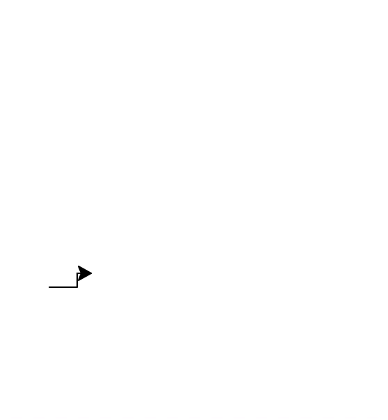

24年GESP 9月认证 Python一级真题解析(二判断题部分)  
**第 1 题** 小杨最近开始学习Python编程，老师说Python是一门高级语言。（ ）  
答案：**对**  
**解析**：  
python是一门高级语言，它的语法简洁，易于学习，适合初学者入门。 同样是高级语言的还有Java、C++、C#等。
图形化编程语言有Scratch等。

**第 2 题** 在Python中，表达式 10/2 和 10//2 的值相同，都是整数5。( )  
答案：**错**  
**解析**：  
在Python中，表达式``10/2``的值是``5.0``，表达式``10//2``的值是``5``。  
``/``是除法运算，结果是浮点数；``//``是整除运算，结果是整数。

**第 3 题** Python语句print(int(input()))能接收形如正整数、负整数和0输入，输入含字母或带小数点数，将导致错误。 ()  
答案：**对**  
**解析**：  
Python语句``int(input())``的int()函数将用户输入的字符串转换为整数，只能接受整数类型的字符串输入，如果输入含字母或带小数点数的字符串，将导致错误。

**第 4 题** 下面的Python代码执行过程中不会出现错误，且其输出为45。（ ）  

```python
for i in range(10):
    Sum += i
print(Sum)
```

答案：**错**  
**解析**：  
Python代码执行过程 Sum +=i 等同于 Sum = Sum + i，但是在代码中没有初始化Sum的值，等号右边的Sum未定义初始化，所以会报错。

**第 5 题** 下面Python代码执行后将输出100。（ ）  

```python
for i in range(100):
    continue
print(i)
```

答案：**错**  
**解析**：
Python代码执行后，for循环遍历0到99，continue语句用于跳过当前循环的剩余语句，然后继续下一次循环，所以最后一次i的值是99。 print(i)输出的是99。  

**第 6 题** 下面Python代码执行后，最后一次输出是10。（ ）

```python
for i in range(1,10,3):
    print(i)
```

答案：**错**  
**解析**：
Python代码执行后，for循环遍历1到9，步长为3，所以输出i的是1、4、7。

**第 7 题**  在Python循环语句中，break通常与if语句配合使用。（ ）  

答案：**对**  
**解析**：  
在Python循环语句中，break通常与if语句配合使用。当if条件满足时，执行break语句，提前终止当前层次循环。  

**第 8 题** 在Python代码中，不可以将变量命名为five-star，因为变量名中不可以出现-（减号）符号。（ ）

答案：**错**  
**解析**：
在Python代码中，可以将变量命名为five-star，因为变量名中可以出现-（减号）符号。但是不建议将变量命名为five-star，不利于代码的阅读和维护。  
Python变量名的命名规则：  

1. 变量名只能包含字母、数字和下划线。  
2. 变量名可以以字母或下划线开头，但不能以数字开头。  
3. 变量名不能包含空格。  
4. 变量名不能包含Python关键字。  

**第 9 题** Python代码turtle.home()可以清除海龟绘图，且海龟将回到原点，海龟方向重置为初识方向。（ ）

答案：**错**
**解析**：
Python代码``turtle.home()``可以将海龟移动到原点，海龟方向重置为初始方向。但是**不能清除已经绘制的图形**。

**第 10 题** 下面Python代码执行后将绘制从左到右逐步升高的台阶。（ ）

```python
import turtle
for i in range(10):
    turtle.forward(20)
    turtle.left(90)
    turtle.forward(10)
    turtle.right(90)
```

答案：**对的**
**解析**：
Python代码执行后， 循环10次。
turtle.forward(20)表示向前移动20个像素， 
turtle.left(90)表示向左旋转90度，  
turtle.forward(10)表示向前移动10个像素， 
turtle.right(90)表示向右旋转90度。
运行的结果如下


