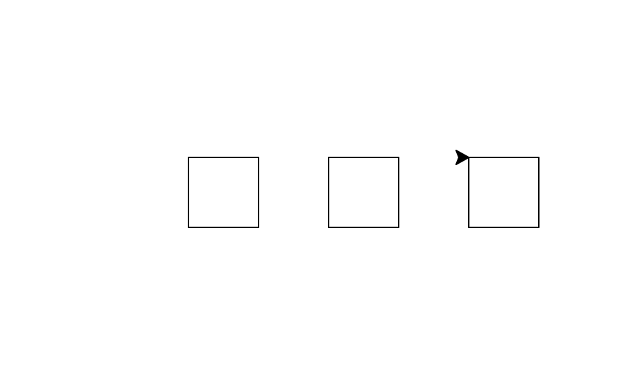

24年GESP 12月认证 Python一级真题解析(二判断题部分)  

**第 1 题** 在Windows的资源管理器中为已有⽂件A建⽴副本的操作是Ctrl+C ，然后Ctrl+V 。( )  
答案：**对**  
**解析**：  
在Windows的资源管理器中，为已有⽂件A建⽴副本的操作是Ctrl+C ，然后Ctrl+V。所以答案是对的。

**第 2 题** 在Python中 ，表达式 8//3 和 8%3 的值相同。( )  
答案：**对**  
**解析**：  
在Python中，表达式``8//3``代表8除以3取整, 值是``2``，
表达式``8%3``代表8除以3取余数, 值是``2``，  
所以表达式 8//3 和 8%3 的值相同。  

**第 3 题**Python语句 print(input()) 能接收键盘输⼊并原样输出 。 ( )  
答案：**对**  
**解析**：  
Python语句``print(input())``代码表示接收键盘输入并原样输出。所以答案是对的。

**第 4 题** Python语句 print(input()) 能接收键盘输⼊并原样输出 。 ( )  

```python
N = 0
for i in range(10):
    continue
    N += 1
print(N)
```

答案：**错**  
**解析**：  
Python代码执行后，for循环遍历0到9，continue语句用于跳过当前循环的剩余语句，然后继续下一次循环，所以N的值一直是0。 print(N)输出的是0。

**第 5 题** 下⾯Python代码执⾏后将输出99 。（ ）  

```python
for i in range(100):
    continue
print(i)
```

答案：**错**  
**解析**：  
Python代码执行后，for循环遍历0到99，continue语句用于跳过当前循环的剩余语句，然后继续下一次循环，所以最后一次i的值是99。 print(i)输出的是99。

**第 6 题** 下⾯Python代码被执⾏时 ，将执⾏⼀次输出（即第⼆⾏将被执⾏⼀次） 。 ( )  

```python
for i in range(10,3):
    print(i)
```

答案：**错**  
**解析**：  
题目中的Python代码，for循环的范围是range(10,3)，但是range()函数的第一个参数是起始值，第二个参数是结束值，所以range(10,3)是一个空的范围，不会执行输出。

**第 7 题**  Python语句 print(3,2) 执⾏后 ，将输出3和2 ，且3和2之间有空格间隔。 ( )  

答案：**对**  
**解析**：  
在Python中，print()函数默认输出的内容之间是有空格间隔的，所以print(3,2)输出的是3和2，且3和2之间有空格间隔。

**第 8 题** 在Python代码中 ，studentName、student_name以及sStudentName都是合法的变量名称。( )  

答案：**对**
**解析**：  
 Python变量名的命名规则：  

1. 变量名只能包含字母、数字和下划线。  
2. 变量名可以以字母或下划线开头，但不能以数字开头。  
3. 变量名不能包含空格。  
4. 变量名不能包含Python关键字。  
题目中的studentName、student_name以及sStudentName都是合法的变量名称。

**第 9 题** Python的turtle中 ，turtle.right()参数必须为正数 。 ( )  

答案：**错**  
**解析**：  
Python的turtle中，turtle.right()参数可以为正数也可以为负数，正数表示向右旋转，负数表示向左旋转。

**第 10 题** 下⾯的Python代码被执⾏后将绘制3个间隔为50、边长也为50的正⽅形 。 ( )  

```python
import turtle
for i in range(3):
    turtle.penup()
    turtle.forward(100)
    turtle.pendown()
    for j in range(4):
        turtle.forward(50)
        turtle.right(90)
```

答案：**对的**  
**解析**：  
题目中的Python代码含义如下：

```python
import turtle
for i in range(3): #循环3次
    turtle.penup() #抬起画笔
    turtle.forward(100) #向前移动100
    turtle.pendown()  #落下画笔
    for j in range(4): #循环4次
        turtle.forward(50) #向前移动50
        turtle.right(90)    #向右旋转90度
```

Python代码执行后，循环3次，每次绘制一个正方形，正方形的边长为50，间隔为50。


