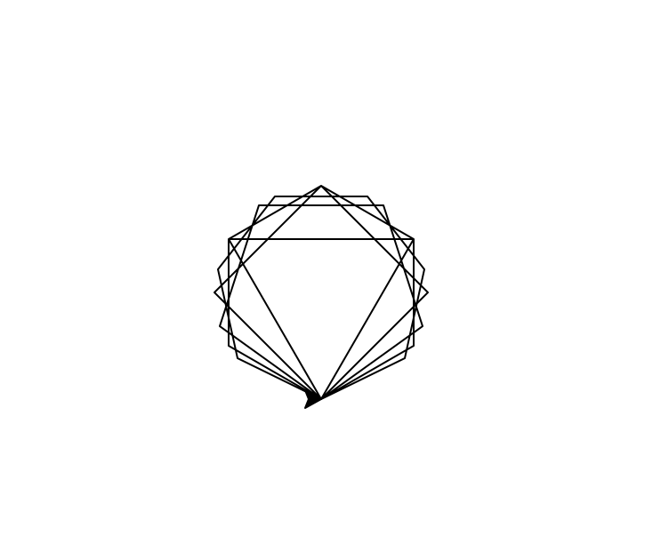

25年GESP 3月认证 Python一级真题解析(二判断题部分)  

**第 1 题** C++、Python都是高级编程语言，它们每条语句的执行最终都要通过机器指令来完成。（ ）  
答案：**对**  
**解析**：  
C++和Python都是高级编程语言，它们的每条语句在执行时，最终都会被编译或解释成机器指令，以便计算机能够理解和执行。因此，答案是对的。

**第 2 题** 在Python中表达式 N ** 2 // N 中如果 N 的值为正整数，则其值为2。( )  
答案：**错**  
**解析**：  
在Python中，表达式``N ** 2 // N``表示N的平方除以N。对于正整数N，这个表达式的值是N，而不是2。  
例如，如果N=3，则``3 ** 2 // 3 = 9 // 3 = 3``。  
因此，答案是错的。

**第 3 题**执行如下Python代码如果在键盘上输入10，执行后将输出20。 ( )  

```python
N = input("请输入正整数：")
print(N * 2)
```

答案：**错**  
**解析**：  
在Python中，`input()`函数接收用户输入并返回一个字符串。  
因此，当输入10时，`N`的值是字符串"10"。  
执行`print(N * 2)`时，Python会将字符串"10"重复两次，而不是进行数值计算，所以输出结果是"1010"，而不是20。

**第 4 题** 删除下面Python代码中的continue不影响程序的执行效果。（ ）  

```python
for i in range(100):
    if i % 2 == 0:
        print("偶数")
        continue
    else:
        print("奇数")
```

答案：**对**  
**解析**：  
在这段Python代码中，`continue`语句用于跳过当前循环的剩余部分并开始下一次循环。  
如果删除`continue`语句，程序仍然会输出偶数和奇数，因为`print("偶数")`和`print("奇数")`语句在各自的条件分支中仍然会被执行。  
因此，删除`continue`不会影响程序的执行效果，答案是对的。

**第 5 题** 下面Python代码执行时将报错，因为所在位置应该是变量名，而不可以做变量名。（ ）  

```python
for _ in range(100):
    print("*")
```

答案：**错**  
**解析**：  
在Python中，`_`是一个合法的变量名，通常用于表示一个临时变量或不需要使用的变量。
因此，`for _ in range(100):`是合法的语法，不会报错。

**第 6 题** 下面Python代码被执行后，将先后输出3和5。（ ）  

```python
for i in range(3, 5, 2):
    print(i)
```

答案：**错**  
**解析**：  
在Python中，`range(3, 5, 2)`表示从3开始，到5结束（不包括5），步长为2。  
因此，循环将只执行一次，`i`的值为3，然后输出3。  
因此，输出结果是3，而不是3和5。  

**第 7 题**  下面的Python代码执行后将先后输出10个True。（ ）  

```python
for i in range(10):
    print(i ** 2 == i * i)
```

答案：**对**  
**解析**：  
在Python中，`i ** 2`表示`i`的平方，而`i * i`也表示`i`的平方。  
因此，对于所有的`i`值，`i ** 2 == i * i`都为True。  
所以，执行这段代码后将先后输出10个True。  

**第 8 题** 在Python代码中， user_Name 、 _userName 、 user-Name 、 userName_ 都是合法的变量名。（ ）

答案：**错**  
**解析**：  
 Python变量名的命名规则：  

1. 变量名只能包含字母、数字和下划线。  
2. 变量名可以以字母或下划线开头，但不能以数字开头。  
3. 变量名不能包含空格。  
4. 变量名不能包含Python关键字。  
在选项中，`user-Name`包含了一个连字符（-），这是不允许的，因此它不是一个合法的变量名。其他选项都是合法的变量名。

**第 9 题** 下面的Python代码执行后，海龟指向与初始一样，即和指向0度方向一致。（ ）

```python
import turtle
for i in range(4):
    turtle.right(90)
```

答案：**对**  
**解析**：  

在Python的`turtle`模块中，`turtle.right(90)`表示向右旋转90度。  
执行4次后，海龟将旋转360度（90度 * 4 = 360度），这意味着它回到了初始方向。  
因此，海龟指向与初始一样，即和指向0度方向一致。  所以答案是对的。

**第 10 题** 下面的Python代码被执行后将绘出围绕同一中心的正多边形。（ ）  

```python
import turtle
for i in range(3,8):
    turtle.circle(60,steps = i)
```

答案：**对的**  
**解析**：  
在Python的`turtle`模块中，`turtle.circle(radius, steps=i)`绘制一个半径为`radius`的圆或多边形，其中`steps`参数指定边数。  
执行这段代码时，`for i in range(3, 8)`会依次取值3到7，因此会绘制出边数为3到7的正多边形。


