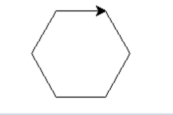

25年GESP 3月认证 Python一级真题解析(一选择题部分)  

**第 1 题** 2025年春节有两件轰动全球的事件，一个是DeepSeek横空出世，另一个是贺岁片《哪吒2》票房惊人，入了全球票房榜。下面关于DeepSeek与《哪吒2》的描述成立的是( )。  
A. 《哪吒2》是一款新型操作系统  
B. DeepSeek是深海钻探软件  
C. 《哪吒2》可以生成新的软件  
D. DeepSeek可以根据《哪吒2》的场景生成剧情脚本  

**答案**：**D**  
**解析**：  
**DeepSeek**是一个人工智能模型，可以根据输入生成文本内容，包括剧情脚本等。  
《哪吒2》作为一部动画电影，其场景和剧情可以被DeepSeek分析并生成相关的脚本内容。  
所以**选项D**是正确的。  

**第 2 题** 在某集成开发环境中编辑一个源代码文件时不可以执行下面（ ）操作。  
A. 修改变量定义  
B. 保存代码修改  
C. 撤销代码修改  
D. 插入执行截图  

**答案**：**D**  
**解析**：  
在集成开发环境（IDE）中，通常可以执行修改变量定义、保存代码修改和撤销代码修改等操作。  
插入执行截图通常不是源代码编辑的操作，而是文档编辑或报告编写中的操作。  
所以**选项D**是正确的。  

**第 3 题** 有关下列Python代码的说法，错误的是( )。  

```python
print("我爱码代码！")

```

A. 配对双引号内的汉字改为英文Hello,Python代码能正确执行  
B. 代码中的双引号，可以改为两个单引号  
C. 代码中的双引号，可以改为三个单引号  
D. 代码中的双引号，可以改为三个双引号  

**答案**：**B**  
**解析**：  
**选项B**错误。将代码中的双引号改为两个单引号会导致语法错误。  
因为第一对单引号会被解释为一个空字符串，第二队单引号同样会被解释为一个空字符串，导致中间的字符串，无法正确解析，导致语法错误。  

**第 4 题** Python表达式 `16 // 4 % 2` 的值是( )。

A. 8  
B. 4  
C. 2  
D. 0  

**答案**：**D**  
**解析**：  
在Python中，运算符的优先级是从高到低的顺序为：

1. **（乘方）  
2. +x、-x（正号、负号）  
3. *、/、//、%（乘法、除法、整除、取余）  
4. +、-（加法、减法

表达式 **16 // 4 % 2** 的计算顺序是：首先计算整除：**16 // 4 = 4** 然后计算取余：**4 % 2 = 0** 所以最终结果是0。

**第 5 题** 在Python中，假设N为正整数12，则 print(N % 3 + N // 5) 将输出( )。

A. 6.4  
B. 2.4  
C. 6  
D. 2  

**答案**：**D**  
**解析**：  
表达式 **N % 3 + N // 5** 的计算顺序是：

1. 计算取余：**N % 3 = 12 % 3 = 0**
2. 计算整除：**N // 5 = 12 // 5 = 2**
3. 将两部分结果相加：**0 + 2 = 2**
所以最终输出是**2**。选择D。

**第 6 题**  下面Python代码执行后的输出是( )。

```python
N = 10
print(f"N*N={N*N}")
```

A. 10*10={10*10}  
B. 100=100
C. N*N=100  
D. N*N={100}  
**答案**：**C**  
**解析**：  
在Python中，f-string（格式化字符串）允许在字符串中嵌入表达式。  
表达式 **{N*N}** 在f-string中会被计算为 **100**，所以输出结果是 **N*N=100**。选择C。

**第 7 题** 执行下面的Python代码，在键盘上先后输入100和200，输出是（ ）。

```python  
first = input("请输入第1个正整数：")
second = input("请输入第2个正整数：")
print(first + second)
```

A. 300  
B. 100200  
C. '100200'  
D. 100 200  

**答案**：**B**  
**解析**：  
在Python中，`input()` 函数接收用户输入并返回一个字符串。  
因此，当输入100和200时，`first` 和 `second` 都是字符串类型。  
当执行 `print(first + second)` 时，实际上是将两个字符串连接起来，所以输出结果是 **100200**。选择B。

**第 8 题** 有关下列Python代码 print(input()) 的说法，**错误**的是（ ）。  
A. input()函数的输出可以作为函数print()的输入  
B. 该代码执行后将输出从键盘上输入的内容  
C. input()函数的输出是函数print()的参数  
D. 该代码存在错误，input()函数应该有提示信息，该提示信息是input()的参数  

**答案**：**D**  
**解析**：  
在Python中，`input()` 函数可以没有参数，直接接收用户输入并返回一个字符串。  
因此，**选项D**是错误的。即使没有提示信息，代码仍然可以正常执行。

**第 9 题** 下面Python代码执行后，将输出能被2整除且除以7余数为2的数。下列选项不能实现的是（ ）。

```python
for i in range(100):
    if ________________:
        print(i)
```  

A. i % 2 == 0 and i % 7 == 2  
B. not(i % 2) and i % 7 == 2  
C. not(i % 2) and not(i % 7)  
D. i % 2 != 1 and i % 7 == 2  

**答案**：**C**  
**解析**：  
在Python中的if判断语句中，1和0分别代表True和False。  
 选项C中的 `not(i % 2)` 和 `not(i % 7)` 分别表示i能被2整除和i能被7整除，  
 这与题目要求的“能被2整除且除以7余数为2”不符。  
因此，选项C不能实现题目要求的功能。  

**第 10 题** 下面Python代码执行后输出是（ ）。

```python
tnt = 0
for i in range(-1000, 1000):
    tnt += i
print(tnt)
```  

A. -1000  
B. 0  
C. 999  
D. 1000  

**答案**：**A**  
**解析**：  
在Python中，`range(-1000, 1000)` 生成的是从 -1000 到 999 的整数序列。  
因此，循环中的 `tnt += i` 会将所有这些整数相加。  
由于正数和负数的对称性，所有的正数和负数相加后会抵消掉，所以最终结果是 -1000。选择A。  

**第 11 题** 下面Python代码执行后输出的是（ ）。

```python
for i in range(1, 100, 5):
    continue
print(i)
```  

A. 100  
B. 96  
C. 1  
D. 0  

**答案**：**B**  
**解析**：  
在Python中，`range(1, 100, 5)` 生成的是从1开始到99的整数序列，步长为5，即1, 6, 11, ..., 96。  
循环中的 `continue` 语句会跳过当前迭代的剩余部分，但不会影响循环变量 `i` 的值。  
因此，循环结束后，`i` 的值是最后一个生成的数，即96。所以输出是96。选择B。  

**第 12 题** 下面Python代码执行后输出的是（ ）。

```python
tnt = 0
for i in range(5, 100, 5):
    if i % 2 == 0:
        continue
    tnt += 1
    if i % 3 == 0 and i % 7 == 1:
        break
print(tnt)
```  

A. 500  
B. 450  
C. 10  
D. 2  

**答案**：**D**  
**解析**：  
对上面的代码进行分析：

1. `range(5, 100, 5)` 生成的数是5, 10, 15, ..., 95。
2. 在循环中，只有当 `i` 是奇数时，才会执行 `tnt += 1`。
3. 奇数的数有5, 15, 25, ..., 95。
4. 当 `i` 是15时，满足 `i % 3 == 0 and i % 7 == 1` 的条件(**被3整除且除以7余1**)，因此会执行 `break`，跳出循环。
5. 在跳出循环之前，`tnt` 的值为2（因为15是奇数,前面还有一个奇数5）。
6. 最终输出 `tnt` 的值为2，所以输出是2。  
7. 选择D。

**第 13 题** 下面Python执行后，海龟指向135度，横线处填入代码错误的是（ ）。

```python
import turtle
for i in range(_______):
    turtle.left(45)
```  

A. 3  
B. 1, 4  
C. 1, 5, 2  
D. 1, 6, 2  

**答案**：**C**  
**解析**：  
**代码分析**：在Python中，`turtle.left(45)` 会使海龟向左转45度。  
如果要使海龟指向135度，初始方向是0度（向右），需要转动135度。  
因此，正确的循环次数应该是3次（每次转45度，总共转135度）。  
选项C中的 `1, 5, 2` 是错误的，因为它们的和不等于3。  

**第 14 题** 为在Python Turtle中输出如下图形，代码横线处应填入（ ）。


```python
import turtle
for i in range(_________):
    turtle.right(60)
    turtle.forward(50)
```  

A. 6  
B. 7  
C. 10  
D. 11  

**答案**：**A**  
**解析**：  
**代码分析**： 在Python Turtle中，`turtle.right(60)` 会使海龟向右转60度。  
要画一个正六边形，每个内角是120度，所以需要转动60度。  
因此，循环次数应该是6次（每次转60度，总共转360度）。  
所以正确答案是6。选择A。

**第 15 题** 下面的Python执行后，输出的图形是（ ）。

```python
import turtle
for i in range(1, 20):
    if i % 5 == 0:
        turtle.penup()
        turtle.forward(50)
        turtle.pendown()
    turtle.left(90)
    turtle.forward(50)
```


 

**答案**：**A**  
**解析**：  
**代码分析**：

1. 在Python Turtle中，`turtle.penup()` 会使海龟抬起笔，`turtle.pendown()` 会使海龟放下笔。  
2. 每当 `i` 是5的倍数时，海龟会抬起笔并向前移动50个单位，然后放下笔继续绘制。  
3. 因此，海龟会在每5个单位的间隔处抬起笔，形成一个正方形的图案。  
4. 所以输出的图形是一个正方形。选择A。  
下面是动态演示过程

