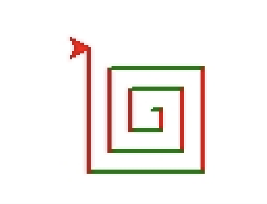
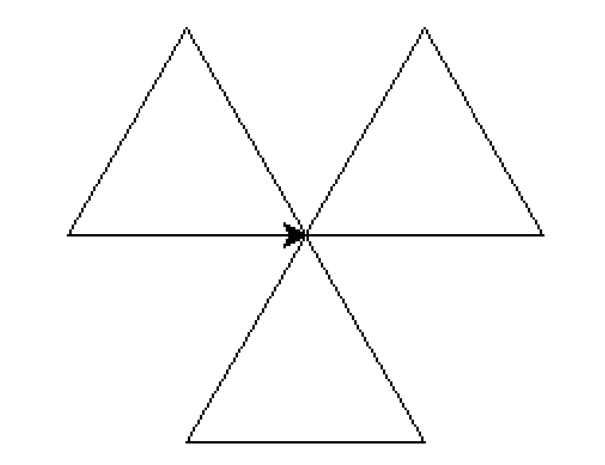

25年GESP 6月认证 Python一级真题解析(一选择题部分)  

 **第 1 题** 2025年4月19日在北京举行了一场颇为瞩目的人形机器人半程马拉松赛。比赛期间，跑动着的机器人会利用身上安装的多个传感器所反馈的数据来调整姿态、保持平衡等，那么这类传感器类似于计算机的( )。  
A. 处理器  
B. 存储器  
C. 输入设备  
D. 输出设备  

**答案**：**C**  
**解析**：  
机器人身上的传感器负责收集环境信息并将其传递给计算机进行处理，这与计算机的输入设备功能相似。  
因此，**选项C**是正确的。  

**第 2 题** 小杨购置的计算机使用一年后觉得内存不够用了，想购置一个容量更大的内存条，这时其需要的内存条是（）。  
A. RAM  
B. ROM  
C. CACHE  
D. EPROM  

**答案**：**A**  
**解析**：  
小杨需要的是一种可以临时存储数据的内存条，而RAM（随机存取存储器）正是用于存储正在使用的程序和数据的。  
因此，**选项A**是正确的。  

* ROM（只读存储器）用于存储固化的程序和数据，
* CACHE（高速缓存）用于提高处理器访问速度，
* EPROM（可擦除可编程只读存储器）用于存储固化程序但可以擦除重写，这些都不符合小杨的需求。  

**第 3 题** 下列Python代码执行后，其结果是( )。  

```python
first = 10
print(f"{First}")
```

A. 输出10  
B. 输出 {first}  
C. 输出 "{first }"  
D. 报错，因为{First}中的First应该是first。  

**答案**：**D**  
**解析**：  
该代码使用了f-string格式化字符串，但在花括号中使用了不正确的变量名`First`（首字母大写），而实际定义的变量名是`first`（首字母小写）。因此，代码会报错，提示未定义的变量`First`。  
所以，**选项D**是正确的。   
补充说明：在Python中，**变量名是区分大小写的**，因此`first`和`First`是两个不同的变量。  

**第 4 题** Python表达式 **14 - 3 * 3 ** 2** 的值是( )。  
A. 99  
B. 25  
C. -13  
D. -67  
**答案**：**C**  
**解析**：  
根据运算优先级，首先计算幂运算`3 ** 2`，结果为9；然后进行乘法运算`3 * 9`，结果为27；最后进行减法运算`14 - 27`，结果为-13。  
因此，**选项C**是正确的。  

**第 5 题** 下面的Python代码执行后，其输出是( )。

```python
x = 10
y = 20
x = x + y
y = x - y
x = x - y
print(x, y)
```

A. 10 20  
B. 20 10  
C. 10 10  
D. 20 20  

**答案**：**B**  
**解析**：  
该代码通过一系列的加减法运算实现了两个变量的值交换。具体过程如下：

1. `x = x + y` 使得 `x` 的值变为30，`y` 的值仍为20。
2. `y = x - y` 使得 `y` 的值变为10（30 - 20）。
3. `x = x - y` 使得 `x` 的值变为20（30 - 10）。
最终，`x` 和 `y` 的值分别为20和10。因此，**选项B**是正确的。

**第 6 题** 下面Python代码执行后的输出是( )。

```python
a, b, c = 3, 4, 5
print(f"a={a} b={b} c={c},a^2+b^2={a**2+b**2},c^2={c**2}")
```

A. a=3 b=4 c=5,a^2+b^2=25,c^2=25
B. 3=3 4=4 5=5,9+16=25,25=25  
C. a={a} b={b} c={c},a^2+b^2={a**2+b**2},c^2={c**2}  
D. a=3 b=4 c=5,1+6=25,7=25  

**答案**：**A**  
**解析**：  
该代码使用了f-string格式化字符串，输出了变量的值以及计算结果。具体输出为：

```
a=3 b=4 c=5,a^2+b^2=25,c^2=25
```

因此，**选项A**是正确的。

**第 7 题** 阅读下面的Python代码，横线上应填入的代码是（ ）。

``` python  
YearOld = input("您今年的整数年龄是?")
print(f"您出生于__________年。")
```

A. {2025-int(YearOld)}
B. {2025-YearOld}  
C. {2025}-{int(YearOld)}  
D. {2025}-{YearOld}  

**答案**：**A**  
**解析**：  
根据题意，用户输入的是今年的年龄，假设今年是2025年，那么用户的出生年份可以通过`2025 - int(YearOld)`来计算。  
因此，**选项A**是正确的。

**第 8 题** 下面Python代码执行后的输出是（ ）。

```python
a = 3
b = 4
print("a+b=", a+b, "a+b={a+b}")
```

A. a+b= 7 a+b={a+b}  
B. a+b=7 a+b=7  
C. a+b=7a+b={a+b}  
D. a+b=7a+b=7  

**答案**：**A**  
**解析**：  
该代码中，`print`函数输出了字符串和变量的值。`a+b=`后面跟的是变量`a`和`b`的和，即7，而`a+b={a+b}`是一个普通字符串，不会进行变量替换。  
因此，输出结果为：
```
a+b= 7 a+b={a+b}
```

所以，**选项A**是正确的。

**第 9 题** 下面的Python代码用于求M天后是星期几，横线处应填入的代码是（ ）。

``` python
N = int(input("当前星期几？")) #星期日是0
M = int(input("求多少天后？")) #输入正整数
D = __________________
if ______________:
    print(f"{M}后是星期日")
else:
    print(f"{M}后是星期{D}")
```

A. 选项

```python
(N + M) // 7
D == 0
```

B. 选项

```python
(N + M) % 7
D == 0
```

C. 选项

```python
(N + M) // 7
D <= 0
```

D. 选项

```python
(N + M) % 7
D = 0
```

**答案**：**B**    
**解析**：  
根据题意，要求M天后是星期几，可以通过`(N + M) % 7`来计算得到星期几的编号，然后判断是否为0来确定是否是星期日。  
因此，**选项B**是正确的。

**第 10 题** 下面Python代码执行后输出是（ ）。

``` python
for i in range(1,11,3):
    continue
    if i % 2 == 0:
        break
    print(i,end="#")
else:
    print("END")
```

A. END  
B. 1#  
C. 1#4#END  
D. 1#4#7#10#END  

**答案**：**A**  
**解析**：  
该代码中的`continue`语句会导致循环在每次迭代时跳过后续的代码，  
因此`if`语句和`print`语句都不会被执行。最终，`else`语句中的`print("END")`会被执行。因此，输出结果为`END`。  
所以，**选项A**是正确的。

**第 11 题** 下面的Python代码用于求N的所有因数，如输入12则将输出 12,6,4,3,2,1 。（ ）。

``` python
N = int(input())
i = N
while  ______________:
    if N % i == 0:
        print(i, end = ",")
    i -= 1
print(1)
```
A. i <= 1  
B. i == 1   
C. i > 1   
D. i >= 1   

**答案**：**C**  
**解析**：  
在代码中，最后一行`print(1)`，则上面循环的打印的最后一个数字是2，因此可以得出`i`的最终值是1。  
因此，**选项C**是正确的。

**第 12 题** 下面Python代码执行后输出的是（ ）。  
``` python
Sum = 0
for i in range(10):
    if i % 2 == 0:
        continue
    if i % 5 == 0:
        break
    Sum += i
print(Sum)
```
A. 55  
B. 15  
C. 9  
D. 4  

**答案**：**D**  
**解析**：  
在代码中，`Sum`的初始值为0，循环遍历0到9的数字。对于偶数，使用`continue`跳过；对于5的倍数，使用`break`终止循环。最终，只有1和3被加到`Sum`中，因此输出结果为4。  
所以，**选项D**是正确的。

**第 13 题** turtle.forward(100)是（ ）。  
A. 让海龟向右转100度  
B. 让海龟向上移动100像素  
C. 让海龟向前移动100像素  
D. 让海龟向前移动100单位  

**答案**：**C**  
**解析**：  
`turtle.forward(100)`是让海龟向前移动100个单位。在turtle图形中，单位通常是像素。  
因此，选项C是正确的。


**第 14 题** 为在Python Turtle中输出如下图形，代码横线处应填入（ ）。  

``` python
import turtle
turtle.pensize(2)
for i in range(____________):
    if i % 2 == 0:
       turtle.color("red")
    else:
       turtle.color("green")
turtle.forward(i * 5)
turtle.right(90)
```
A. 11  
B. 1, 12   
C. 1, 13  
D. 14  

**答案**：**C**  
**解析**：  
通过观察图像可以等到如下信息
1. 一开始的的线段颜色是绿色的
2. 结束的颜色是红色的
3. 整个线段的数量是12  
所以答案选择**C**。


**第 15 题** 为在Python Turtle中输出如下图形，代码横线处应填入（ ）。  

```
import turtle
for i in range(9):
    turtle.forward(100)
    turtle.left(120)
    if i % 3 == 2:
        turtle.right(____________)

```
A. 30   
B. 60  
C. 90  
D. 120  

**答案**：**D**  
**解析**：  
观察图片可以得到信息再画好一个正三角形后，接下来需要转动120度才能画出下一个正三角形。因此，答案选择**D**。


