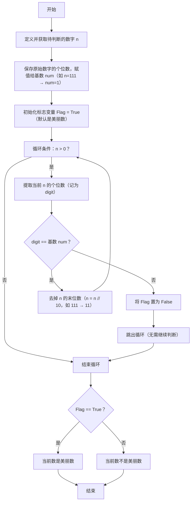

```mermaid
flowchart TD
    A["开始"] --> B["定义并获取待判断的数字 n"]
    B --> C["保存原始数字的个位数，赋值给基数 num（如 n=111 → num=1）"]
    C --> D["初始化标志变量 Flag = True（默认是美丽数）"]
    D --> E{"循环条件：n > 0？"}
    E -- 是 --> F["提取当前 n 的个位数（记为 digit）"]
    F --> G{"digit == 基数 num？"}
    G -- 否 --> H["将 Flag 置为 False"]
    H --> I["跳出循环（无需继续判断）"]
    G -- 是 --> J["去掉 n 的末位数（n = n // 10，如 111 → 11）"]
    J --> E["循环条件：n > 0？"]
    E -- 否 --> K["结束循环"]
    I --> K
    K --> L{"Flag == True？"}
    L -- 是 --> M["当前数是美丽数"]
    L -- 否 --> N["当前数不是美丽数"]
    M --> O["结束"]
    N --> O["结束"]

```