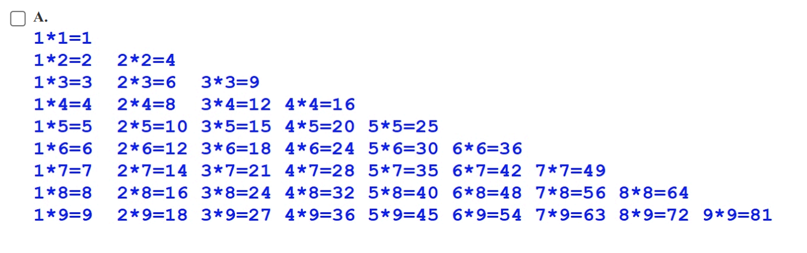
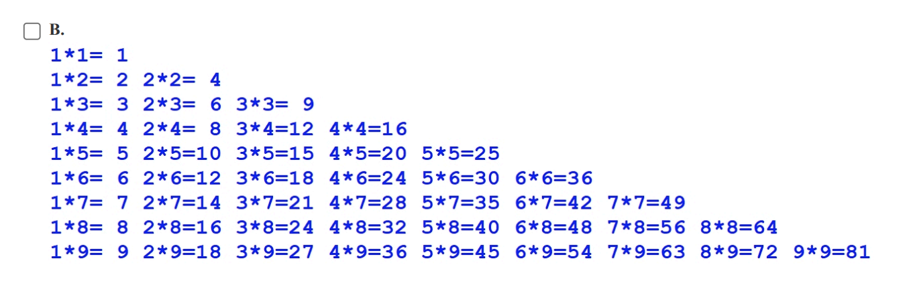
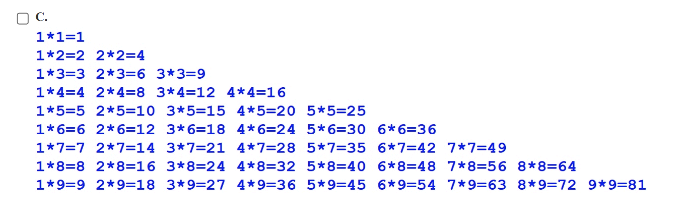
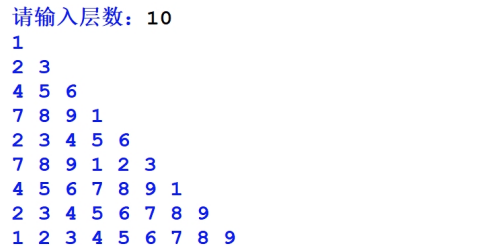

25年GESP 3月认证 Python二级真题解析(一选择题部分)  

**第 1 题**  2025年春节有两件轰动全球的事件，一个是DeepSeek横空出世，另一个是贺岁片《哪吒2》票房惊人，入了全球票房榜。下面关于DeepSeek与《哪吒2》的描述成立的是( )。  
A. 《哪吒2》是一款新型操作系统  
B. DeepSeek是深海钻探软件  
C. 《哪吒2》可以生成新的软件  
D. DeepSeek可以根据《哪吒2》的场景生成剧情脚本  

**答案**：**D**  
**解析**：  
**DeepSeek**是一个人工智能模型，可以根据输入生成文本内容，包括剧情脚本等。  
《哪吒2》作为一部动画电影，其场景和剧情可以被DeepSeek分析并生成相关的脚本内容。  
所以**选项D**是正确的。  

**第 2 题**  对整型变量N，如果它能够同时被3和5整除，则输出 N是含有至少两个质因数 。如果用流程图来描述处理过程，则输出语句应该在哪种图形框中（ ）。  
A. 圆形框  
B. 椭圆形框  
C. 平行四边形框  
D. 菱形框  

**答案**：**C**  
**解析**：  
流程图包含不同的图形框来表示不同的操作。  

- **圆形框**通常用于表示开始或结束。
- **椭圆形框**也用于表示开始或结束。
- **平行四边形框**用于输入或输出操作。
- **菱形框**用于表示决策或条件判断。
- **矩形**框用于表示处理或计算操作。
- 在这个题目中，输出语句是一个输出操作，因此应该使用**平行四边形框**。
所以**选项C**是正确的。

**第 3 题**Python语句 print(3+3**(2-2)*3) 执行后输出的值是（ ）。  
A. 11  
B. 6  
C. 4  
D. 3  

**答案**：**B**  
**解析**：  
在Python中，运算符的优先级是从高到低的顺序为：

1. **（乘方）
2. +x、-x（正号、负号）
3. *、/、//、%（乘法、除法、整除）

所以表达式 `3 + 3 ** (2 - 2) * 3` 的计算顺序是：

1. 计算括号内的表达式：`2 - 2 = 0`
2. 计算乘方：`3 ** 0 = 1`
3. 计算乘法：`1 * 3 = 3`
4. 最后进行加法：`3 + 3 = 6`
所以答案选择**B**

**第 4 题** 下面Python代码执行，其输出是( )。

```python
a, b = 3,4
a == b
b == a
print(a,b)
```

A. 3 4  
B. 3 3  
C. 4 4  
D. 4 3  

**答案**：**A**  
**解析**：  
对上面的代码解析如下：  

- `a, b = 3, 4` 将变量 `a` 赋值为 `3`，将变量 `b` 赋值为 `4`。
- `a == b` 和 `b == a` 是比较操作，但它们的结果并没有被存储或使用，因此不会影响输出。
- `print(a, b)` 将输出变量 `a` 和 `b` 的值
- 因此输出结果是 `3 4`。

**第 5 题**  求三色彩球的颜色。有数量无限的红(Red)绿(Green)蓝(Blue)三种彩球排成一行，每组先为5个红色球，随后3个绿色，最后为2个蓝色。每个球都有编号，从左到右依次为1,2,3……。输入整数代表编号，求该编号球的颜色。  
下面是Python代码的实现，正确说法是( )。

```python
N = int(input())
remainder = N % 10 #remainder变量保存余数
if 1 <= remainder <= 5:
    print("Red")
elif 6 <= remainder <= 8:
    print("Green")
elif remainder == 9 or remainder == 0:
    print("Blue")
```

A. 将 elif remainder == 9 or remainder == 0: 修改为 else 效果相同  
B. 将 if 1 <= remainder <= 5: 修改为 if remainder <= 5: 效果相同  
C. elif 6 <= remainder <= 8: 写法错误，应修改为 elif 6 <= remainder and remainder <= 8  
D. 根据题意 remainder = N % 10 应修改为 remainder = N // 10  

**答案**：**A**  
**解析**：  
**选项A**是正确的，因为在这个上下文中，`elif remainder == 9 or remainder == 0:`可以被简化为`else`，因为所有其他情况都已经被处理了。  
**选项B**是错误的，因为`if remainder <= 5:`会将所有小于等于5的情况都归为红色，**remainder=0**时会输出红色，这与题意不符。  
**选项C**中 `elif 6 <= remainder <= 8:`和` elif 6 <= remainder and remainder <= 8 `在逻辑上是等价的，但后者的写法不够简洁。所以**选项C**是错误的。  
**选项D**是错误的，每组球有10个球，使用`N % 10`来获取余数，根据余数，在1到10之间判断球的颜色。而`remainder = N // 10` 会得到一个整数商，这与题意不符。  
因此，正确答案是**A**。

**第 6 题**  下面Python代码执行后其输出是( )。  

```python
tnt = 0
for i in range(10):
    if i % 3:
        tnt += 1
    else:
        tnt += 2
print(tnt)  
```

A. 18  
B. 17  
C. 16  
D. 14  

**答案**：**D**  
**解析**：  
在这段代码中，`for i in range(10):`会遍历从0到9的整数。

- 当`i % 3`不等于0时（即`i`不是3的倍数），`tnt`增加1。
- 当`i % 3`等于0时（即`i`是3的倍数），`tnt`增加2。
- 具体的计算过程如下：  
- i = 0: `tnt += 2` (tnt = 2)  
- i = 1: `tnt += 1` (tnt = 3
- i = 2: `tnt += 1` (tnt = 4)
- i = 3: `tnt += 2` (tnt = 6)
- i = 4: `tnt += 1` (tnt = 7)
- i = 5: `tnt += 1` (tnt = 8)
- i = 6: `tnt += 2` (tnt = 10)
- i = 7: `tnt += 1` (tnt = 11)
- i = 8: `tnt += 1` (tnt = 12)
- i = 9: `tnt += 2` (tnt = 14)
- 最终输出`tnt`的值为14。
所以答案选择**D**。

**第 7 题**  下面Python代码执行后输出是( )。  

```python
for i in range(10, 0, -2):
    break
print(i)
```

A. 10  
B. 8  
C. 0  
D. 因为循环执行时会执行break语句而终止循环，因此i的值不确定  

**答案**：**A**  
**解析**：  
在这段代码中，`for i in range(10, 0, -2):`会创建一个从10到1的范围，步长为-2。

- 这意味着`i`将依次取值10, 8, 6, 4, 2。
- 但是在第一次迭代时，`break`
语句会立即终止循环。
- 因此，`i`的值在循环结束时仍然是10。
- 最后，`print(i)`将输出`i`的值，即10。

**第 8 题**  下面Python代码执行后输出是（ ）。  

```python
for i in range(10):
    if i % 3 == 0:
        continue
    print("0", end = "#")
else:
    print("1",end = "#")
```

A. 0#0#0#0#0#0#  
B. 0#0#0#0#0#0#0#1#  
C. 0#0#0#0#1#  
D. 0#0#0#0#0#0#1#  

**答案**：**D**  
**解析**：  
在这段代码中，

- `for i in range(10):`会遍历从0到9的整数。  
其中i等于0, 3, 6, 9时，`i % 3 == 0`为真，执行`continue`语句跳过当前循环的剩余部分，不会执行`print("0", end = "#")`。

- 当`i`为1, 2, 4, 5, 7, 8时，`i % 3 != 0`为真，执行`print("0", end = "#")`，输出`0#`。
- 最后，执行`else`部分的`print("1", end = "#")`，输出`1#`。
- 因此，输出结果为`0#0#0#0#0#0#1#`。

**第 9 题**  下面Python代码执行后的输出是（ ）。  

```python
for i in range(5):
    for j in range(i,0,-1):
        print(j,end="-")
```

A. 1-2-1-3-2-1-4-3-2-1-  
B. 1-2-1-3-2-1-4-3-2-1  
C. 0-0-1-0-1-2-0-1-2-3-  
D. 0-0-1-0-1-2-0-1-2-3  

**答案**：**A**  
**解析**：  
在这段代码中,`for i in range(5):`会遍历从0到4的整数。

- 当`i=0`时，内层循环不会执行。
- 当`i=1`时，内层循环`for j in range(1, 0, -1):`会输出`1-`。
- 当`i=2`时，内层循环`for j in range(2, 0, -1):`会输出`2-1-`。
- 当`i=3`时，内层循环`for j in range(3, 0, -1):`会输出`3-2-1-`。
- 当`i=4`时，内层循环`for j in range(4, 0, -1):`会输出`4-3-2-1-`。
- 将所有输出连接起来，得到`1-2-1-3-2-1-4-3-2-1-`。
因此，正确答案是**A**。

**第 10 题**  下面Python代码执行后，将输出能被2整除且除以7余数为2的数。下列选项不能实现的是（ ）。  

```python
for i in range(100):
    if ________________:
        print(i)
```

A. i % 2 == 0 and i % 7 == 2  
B. not(i % 2) and i % 7 == 2  
C. not(i % 2) and not(i % 7)  
D. i % 2 != 1 and i % 7 == 2  

**答案**：**C**  
**解析**：  
在这段代码中，我们需要找到一个条件，使得`i`能被2整除且除以7余数为2。

- **选项A**：`i % 2 == 0 and i % 7 == 2`，这个条件是正确的，因为它直接检查`i`是否能被2整除且除以7余数为2。
- **选项B**：`not(i % 2) and i % 7 == 2`，这个条件也是正确的，因为`not(i % 2)`成立需要`i%2==0`，即`i`能被2整除,所以这个条件也能实现题意。
- **选项C**：`not(i % 2) and not(i % 7)`，这个条件是错误的，`not(i % 7)`成立需要`i % 7 == 0`，即`i`能被7整除，这与题意不符，因为我们需要的是除以7余数为2的数。
- **选项D**：`i % 2 != 1 and i % 7 == 2`，这个条件也是正确的，因为`i % 2 != 1`成立的话需要`i % 2 == 0`，即`i`能被2整除，同时`i % 7 == 2`也满足题意。
因此，不能实现题意的选项是**C**。

**第 11 题**  下面Python代码用于求正整数1到N之间含有3的数的个数，横线处应填入代码先后是（ ）。  

```python
cnt = 0
N = int(input("请输入正整数："))
for i in range(1,N):
    while i != 0:
        if i % 10 == 3:
            cnt +=1
            __________
        else:
            __________
print(cnt)
```

A.

```python
continue
i = i // 10
```

B.

```python
break
i //= 10
```

C.

```python
continue
i %= 10
```

D.

```python
break
i %= 10
```

**答案**：**A**
**解析**：  
在这段代码中，我们需要统计正整数1到N之间含有数字3的数的个数。

- 当`i % 10 == 3`时，说明当前数字的最后一位是3，我们需要增加计数器`cnt`，然后跳过当前数字的最后一位继续检查剩余的数字。
- 因此，应该使用`continue`来跳过当前循环的剩余部分，并使用`i //= 10`来去掉当前数字的最后一位。
- 当`i % 10 != 3`时，我们需要继续检查当前数字的下一位，因此应该使用`i //= 10`来去掉当前数字的最后一位。
- 因此，正确的选项是**A**。

**第 12 题**  下面Python代码用于实现九九乘法表，代码中{i*j}与等号之间有一个空格。代码执行后效果是（ ） 。  

```python
for i in range(1, 10):
    for j in range(1, i + 1):
        print(f"{j}*{i}= {i*j}", end=" ")
    print()
```






**答案**：**D**  
**解析**：  
在这段代码中，

- `for i in range(1, 10):`会遍历从1到9的整数。
- 外层循环`i`从1到9，内层循环`j`从1到`i`。
- `print(f"{j}*{i}= {i*j}", end=" ")`会输出每一行的乘法表达式，格式为`j*i= 结果`，注意结果前有一个空格，并且在每个表达式之间用空格分隔。

**选项D** 符合代码的输出格式，显示了九九乘法表的正确格式。

**第 13 题**  在数学中N!表示N的阶乘，即1到N的乘积，如 3!=1*2*3 ，且 0! = 1 。下面的两段Python代码用于求1-N
的阶乘之和，如N为3，则是 1!+2!+3! 。选项中的说法，正确的是（ ）。  

```python
#实现1
N = int(input())
tnt, last = 0, 1
for i in range(1,N + 1):
    last *= i
    tnt += last
print(tnt)
```

```python
#实现2
N = int(input())
tnt = 0
for i in range(1, N + 1):
    tmp = 1
    for j in range(1,i + 1):
        tmp *= j
    tnt += tmp
print(tnt)
```

A. 虽然实现1的代码短小，但效率并不高  
B. 实现2的代码效率更高，且更易于理解  
C. 实现1因为应用了前项计算结果，计算量更小，因此效率高  
D. 两种实现，效率几乎一致  

**答案**：**C**  
**解析**：  
**A选项**是错误的，因为实现1的代码使用了前项计算结果，效率更高。  
**B选项**是错误的，因为实现2的代码虽然易于理解，但效率较低。  
**C选项**是正确的，因为实现1通过使用前一项的计算结果来计算当前项的阶乘，从而减少了计算量，提高了效率。  
**D选项**是错误的，因为实现1的效率明显高于实现2。  

**第 14 题**  哥德巴赫猜想是指大于2的偶数都可以分解为两个质数之和，下面的代码用于验证4-1000之内的偶数能否分
解为两个质数之和。下面Python代码中假设isPrime()是已经定义好用于判断正整数N是否为质数。对该段代码**错误**的说法是（ ）。  

```python
for i in range(4,1000,2):
    for j in range(2,i):
        if isPrime(j) and isPrime(i-j):
            print(f"{i}={j}+{i-j}")
            break
```

A. 将代码 `isPrime(j) and isPrime(i-j)` 修改为 `isPrime(j) == True and isPrime(i-j) == True` 效果相同  
B. 代码执行后，输出的一对质数，一定是小的数在前  
C. 即便将ange(4,1000,2)中的1000修改为很大的整数，也不能说从数学上证明了哥德巴赫猜想  
D. 根据题意，break语句应该与if对齐  

**答案**：**D**  
**解析**：  
**A选项**是正确的，因为`isPrime(j) and isPrime(i-j)`和`isPrime(j) == True and isPrime(i-j) == True`在逻辑上是等价的。  
**B选项**是正确的，j是从2开始到i的开始找的，如果存在一对质数满足条件，j一定是小的数。
**C选项**是正确的，因为偶数是无穷的，有限的数量的偶数不能证明哥德巴赫猜想
**D选项**是错误的，假如`break`语句与`if`对齐，在第一组数进行判断后，直接跳出内层循环，无法找到所有满足条件的偶数分解成质数的情况。
因此，错误的说法是**D**。

**第 15 题**  下面Python代码实现输出如下图形，相关说法正确的是（ ）。  


```python
N = int(input("请输入层数："))
last = 1
for i in range(1,N):
    for j in range(1,i + 1):
        if last > 9:
            last = 1
        print(last,end = " ")
        last += 1
    print()
```

A. 最后一行的print()有错，应该修改为print("")，print()函数不能没有参数  
B. last += 1修改为last = last + 1执行效果相同  
C. 代码中的range(1, i + 1)应修改为range(1, i)  
D. 外层for循环前的last = 1修改为last = 0执行效果相同  

**答案**：**B**
**解析**：  
**A选项**是错误的，`print()`函数可以没有参数，直接输出一个空行。  
**B选项**是正确的，`last += 1`和`last = last + 1`在功能上是等价的，都是将`last`的值增加1。  
**C选项**是错误的，`range(1, i + 1)`是正确的，因为它确保内层循环从1到`i`（包括`i`），而`range(1, i)`会导致内层循环少执行一次。  
**D选项**是错误的，`last = 1`是为了确保从1开始输出数字，如果修改为`last = 0`，则输出的数字会从0开始，这与题意不符。
因此，正确的选项是**B**。  
