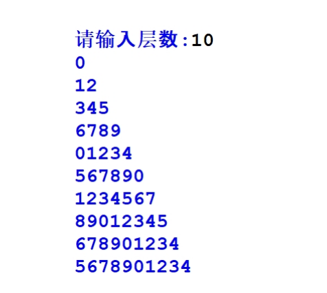

25年GESP 6月认证 Python二级真题解析(一选择题部分)  

**第 1 题** 2025年4月19日在北京举行了一场颇为瞩目的人形机器人半程马拉松赛。比赛期间，跑动着的机器人会利用
身上安装的多个传感器所反馈的数据来调整姿态、保持平衡等，那么这类传感器类似于计算机的( )。  
A. 处理器  
B. 存储器  
C. 输入设备  
D. 输出设备  

**答案**：**C**  
**解析**：  
机器人身上的传感器负责收集环境信息并将其传递给计算机进行处理，这与计算机的输入设备功能相似。  
因此，**选项C**是正确的。


**第 2 题** 小杨购置的计算机使用一年后觉得内存不够用，想购置一个容量更大的内存条，这时需要的内存条是（）。  
A. RAM  
B. ROM  
C. CACHE  
D. EPROM  
**答案**：**A**  
**解析**：  
小杨需要的是一种可以临时存储数据的内存条，而RAM（随机存取存储器）正是用于存储正在使用的数据和程序的内存类型。  
因此，**选项A**是正确的。  


**第 3 题** 下面Python代码执行后的输出是（ ）。  
```python
a, b, c = 3, 4, 5
print(a ** 2 + b * b == c ** 2)
```
A. True  
B. true   
C. 9  
D. 10   

**答案**：**A**  
**解析**：  
在这段代码中，`a ** 2 + b * b` 的计算结果为 `3 ** 2 + 4 * 4`，即 `9 + 16`，最终结果为 `25`，而 `c ** 2` 的结果为 `5 ** 2`，即 `25`。因此，`a ** 2 + b * b == c ** 2` 的结果为 `True`。  
所以，**选项A**是正确的。

**第 4 题**下面Python代码用于获得正整数的第3位数，如1234则输出2。如果是一位数或两位数，则输出0。横线处应填入的代码是( )。

```python
N = int(input("请输入正整数:"))
print(________________)
```
A. N % 1000 // 100  
B. N // 1000 % 100  
C. N / 1000 // 100   
D. N % 1000 / 100  

**答案**：**A**  
**解析**：  
在这段代码中，`N % 1000 // 100` 的计算结果为 `1234 % 1000 // 100`，即 `234 // 100`，最终结果为 `2`。  
因此，**选项A**是正确的。


**第 5 题** 下面的Python代码用于判断输入的正整数N是否为质数，其说法正确的是( )。
``` python
N = int(input("请输入正整数："))
if N <= 1:
    print(f"{N}不是质数")
elif N == 2:
    print(f"{N}是质数")
elif N % 2 == 0 or N % 3 == 0:
    print(f"{N}不是质数")
else:
    for i in range(2, N):
        if N % i == 0:
            print(f"{N}不是质数")
            break
        else:
            print(f"{N}是质数")

```
A. 如果输入2，则将先输出 2是质数 ，然后输出 2不是质数 ，因此程序存在错误  
B. 删除break，对程序执行结果没有影响  
C. 每个if语句只能有一个elif子句，所以本程序有语法错误  
D. 如果输入15，程序中的循环不会被执行  
**答案**：**D**  
**解析**  
`选项A`：如果程序输入2，程序将输出2是质数，而不会输出2不是质数，因此程序没有错误。 **选择A**错误。  
`选项B`：如果删除break语句，则程序将继续执行循环，直到i等于N为止，这样会导致程序错误地判断N为质数。 **选择B**错误。  
`选项C`：每个if语句可以有多个elif子句，因此本程序没有语法错误。 **选择C**错误。  
`选项D`：如果输入15，直接判断15可以被3整除，因此程序会输出15不是质数。 **选择D**正确。  


**第 6 题** 今天星期六，其后第N天星期几？如果是星期一到星期六输出形如：星期1、星期2等，星期天则输出星期
天。下面的Python代码用于完成上述要求，横线处应填上的代码是( )。
``` python
N = int(input())
remainder = __________________
if remainder == 0:
    print(f"星期六后第{N}天是星期天")
else:
    print(f"星期六后第{N}天是星期{remainder}")
```
A. (N + 6) / 7  
B. (N + 6) // 7  
C. N % 7  
D. (N + 6) % 7  
**答案**：**D**  
**解析**：  
在这段代码中，`(N + 6) % 7` 的计算结果可以得到星期几。因为今天是星期六，所以我们需要将N加上6，然后对7取模。这样可以将星期六视为0，星期天视为1，依此类推。  
因此，**选项D**是正确的。

**第 7 题** 下面的Python代码执行后其输出是( )。
``` python
Sum = 0
for i in range(1, 10):
    Sum += i
    if i % 2:
       continue
    if i % 7:
        break
print(Sum)
```
A. 45  
B. 28  
C. 3  
D. 0  

**答案**：**C**  
**解析**：  
在这段代码中，`for i in range(1, 10):`循环会遍历1到9的整数。按照代码含义，`Sum` 会累加所有的整数，第一个判断条件 `i % 2` 会导致所有奇数除以2取余大于0，判断条件生效， 同样第二个判断条件``i % 7``生效的条件是`i`不等于7，因此sum累加的值是`sum=1+2=3`
因此，**选项C**是正确的。

**第 8 题** 下面Python代码执行后其输出是( )。
``` python
for i in range(1, 12):
    for j in range(1, i):
        if i * j % 2 == 1:
            break
else:
    print(i * j)
```
A. 110  
B. 22  
C. 11  
D. 没有输出  
**答案**：**C**  
**解析**：  
在这段代码中，外层循环`for i in range(1, 12):`会遍历1到11的整数。内层循环`for j in range(1, i):`会遍历1到i-1的整数。判断条件`if i * j % 2 == 1:`会在i和j的乘积为奇数时触发`break`，这会导致内层循环提前结束。由于内层循环在i为奇数时会被打断，因此外层循环在i为偶数时才会执行`else`语句，输出`i * j`的值。最终，只有当i为11时，j为1时，`i * j % 2 == 1`成立，break语句执行，代码的双循环结束。  
因此 i * j = 11 * 1 = 11 。  
因此**选项C**是正确的。  

**第 9 题** 下面Python代码执行后输出是( )。  
``` python
cnt = 0
for i in range(-99, 100, 2):
    cnt = 1 + cnt
print(cnt)
```
A. 101  
B. 100  
C. 99  
D. 98  
**答案**：**B**  
**解析**：  
在这段代码中，`for i in range(-99, 100, 2):`循环会遍历-99到99的偶数。每次循环中，`cnt`都会加1。由于范围是-99到99，包含了100个偶数，因此最终输出的`cnt`值为100。

**第 10 题** 下面Python代码执行后输出是（ ）。  
``` python
for i in range(1, 10):
    if i % 3 != 0:
        print("A", end = "#")
        continue
    else:
        break
    print("0", end = "#")
else:
    print("1")
```
A. A#A#  
B. A#0#A#0  
C. A#A#1  
D. A#0#A#0#1  

**答案**：**A**  
**解析**：  
在这段代码中，`for i in range(1, 10):`循环会遍历1到9的整数。判断条件`if i % 3 != 0:`会在i不是3的倍数时执行`print("A", end = "#")`，并继续下一次循环。只有当i为3时，`if i % 3 != 0:`条件不成立，程序会执行`else:`中的`break`语句，导致循环提前结束。  
因此，最终输出的结果是`A#A#`。  

**第 11 题** 下面Python代码执行后的输出是（ ）。  
``` python
for i in range(3):
    for j in range(i):
        print(i, j, end = "-", sep = '#')
print("END")
```
A. 0#0-1#0-2#0-2#1-END  
B. 0#0-1#0-1#1-2#0-2#1-2#2-3#0-3#1-3#2-END  
C. 0#0-1#0-1#1-2#0-2#1-2#2-END  
D. 1#0-2#0-2#1-END  

**答案**：**D**  
**解析**：  
在这段代码中，外层循环`for i in range(3):`会遍历0到2的整数。内层循环`for j in range(i):`会遍历0到i-1的整数。由于内层循环的范围是从1开始的，  
因此当i为0时，内层循环不会执行；  
当i为1时，内层循环会执行一次，输出`1#0-`；  
当i为2时，内层循环会执行两次，输出`2#0-2#1-`。  
最后，程序会输出`END`。因此，最终的输出结果是`1#0-2#0-2#1-END`。  
因此，最终的输出结果是`1#0-2#0-2#1-END`。选择D是正确的。

**第 12 题** 下面Python代码执行后，将输出不能被3整除且除以5余数为2的数。下列选项不能实现的是（ ）。
``` python
for i in range(100):
    if ___________________________:
    print(i)
```
A. i % 3 != 0 and i % 5 == 2  
B. i % 3 and i % 5 == 2  
C. i % 3 and not(i % 5 != 2)  
D. not(i % 3) and i % 5 == 2   
**答案** **D**  
**解析**：  
选项D中的条件是`not(i % 3) and i % 5 == 2`，中``not(i % 3)``的判断条件如果需要成立的话，`i`必须是3的倍数。根据题目要求，我们需要找出不能被3整除且除以5余数为2的数，因此选项D不能实现题目要求。  

**第 13 题** 下面Python代码用于判断一个大于0的正整数是几位数，横线处应填入代码先后是（ ）。
``` python
N = int(input("请输入大于0的正整数："))
cnt = 0
while __________:
    cnt += 1
    ____________
print(cnt)
```
A选项.  
```python
N > 1
N = N // 10
```
B选项.
```python
N > 0
N /= 10
```
C选项. 
``` pyhton
N == 0
N //= 10
```
D选项. 
``` pyhton
N > 0
N //= 10
```
**答案**：**D**  
**解析**：  
在这段代码中，`N > 0`的判断条件确保了循环会在N大于0时继续进行，而`N //= 10`则是将N进行整除10的操作，从而逐步减少N的位数。最终，`cnt`的值将会是N的位数。  
因此，选择D是正确的。


**第 14 题** 判断一个数是否为自守数。自守数的定义是如果一个数的平方其尾数与该数相同，则为自守数，如25的平
方是625，其尾数是25，所以25是自守数。相关说法错误的是（ ）。
```python
N = int(input("输入一个正整数："))
N1, M1 = N, N * N
Flag = True
while N1 > 0:
    if N1 % 10 != M1 % 10:
        Flag = False
        break
    else:
        N1, M1 = N1 // 10, M1 // 10
if Flag == True:
    print(f"{N}的平方是{N * N},是自守数")
else:
    print(f"{N}的平方是{N * N},不是自守数")
```
A. 如果Flag在循环中不被改为False，则说明该数是自守数  
B. 代码 if N1 % 10 != M1 % 10: 用于判断其个位数是否相等，如果不等，则表明不是自守数  
C. 代码 N1, M1 = N1 // 10, M1 // 10 将把个位数去掉  
D. 将 N1 > 0 改为 N > 0 效果相同  
**答案**：**D**  
**解析**： 
`N > 0`的判断条件确保了输入的正整数N是大于0的. 在后面的代码没有N变更，这个条件始终成立，和`N1 > 0`的判断条件是不等价的。  
因此选择D是正确的。  

**第 15 题** 下面Python代码实现输出如下图形，相关说法错误的是（ ）。

``` python
line_number = int(input("请输入层数:"))
now_number = 0
for row in range(1, line_number + 1):
    for i in range(row):
        print(now_number, end = "")
        now_number += 1
        if now_number == 10:
            now_number = 0
    print()
```
A. 代码 now_number = 0 移动到外层循环之下，内层循环之上，且与内层循环的for对齐，效果维持不变  
B. 代码 now_number += 1 修改为 now_number = 1 + now_number 效果维持不变  
C. 将代码 now_number == 10 调整为 now_number > 9 效果维持不变  
D. 将最后一行的print()修改为print("")，效果维持不变  

**答案**：**A**  
**解析**：  
将`now_number = 0`移动到外层循环之下，内层循环之上，且与内层循环的for对齐，效果是每一行都会从0开始计数，而不是继续上一次的计数。所以选择A内容是错误的。  
因此选择A。
