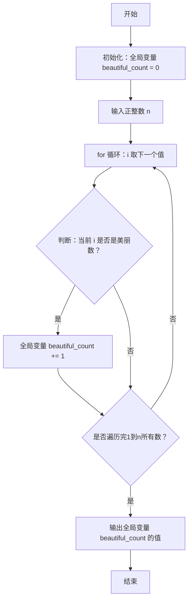
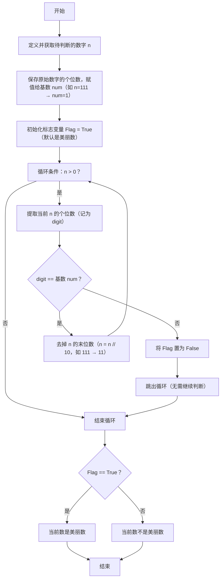

2025年GESP 09月认证-->Python二级真题解析(编程题1-优美的数字)


### 编程题1：优美的数字

- **试题名称**：优美的数字
- **时间限制**：1.0 s
- **内存限制**：512.0 MB


#### 3.1.1 **题目描述**：  
如果一个正整数的所有数位都相同，小 A 就会觉得这个正整数很优美。例如，正整数`6`的数位都是`6`，所以`66`也是优美的；而正整数`123`的数位不相同，所以不是优美的。  
小 A 想知道不超过n的正整数中有多少优美的数字，请你帮他数一数。
#### 3.1.2 **输入格式**： 
一行，一个正整数n。
#### 3.1.3 **输出格式**：
一行，一个正整数，表示不超过n的优美正整数的数量。

#### 3.1.4 **样例**：

##### 3.1.4.1 输入样例 1
```
6
```

##### 3.1.4.2 输出样例 1
```
6
```

##### 3.1.4.3 输入样例 2
```
2025
```
##### 3.1.4.4 输出样例 2
```
28
```
#### 3.1.5 **数据范围**：
对于所有测试点，保证 $1 ≤ n ≤ 2025$

#### 核心考点
循环结构、数位判断、枚举法/数学规律法


### 解题思路

#### 1. 题目理解

1. 输入一个正整数n，判断1，到n之间有多少个数是否是美丽数，将满足条件的数进行计数，最后输出计数结果。
2. 美丽数判断：一个数的每一位数字都相同，则是美丽数。


#### 2. 程序功能点识别
##### 功能点1：(输入一个正整数n，统计1到n中优美数的数量，不包含具体的判断美丽数的逻辑)
- 输入一个正整数n。
- 定义美丽数总个数全局变量，循环判断1到n之间的每个数是否是美丽数。 是美丽数则计数器加1。
- 输出美丽数总个数。



##### 功能点2：单个数判断是否是美丽数的逻辑
- 定义一个基数num，取当前数的个位数。
- 定义一个标志变量Flag，初始值为True，表示当前数默认是美丽数。
- 循环判断当前数的每一位数字是否与基数num相同，如果有一位不同，则将Flag置为False，跳出循环。
- 判断Flag的值，如果为True，则当前数是美丽数，计数器加1。

对应的流程图如下：

 


 

#### 参考代码

```python
# 获取用户输入的上限数字
upper_limit = int(input(""))

# 初始化优美数的计数器（用于保存最终统计结果）
beautiful_number_count = 0  

# 遍历从1到上限的每一个数字，逐个判断是否为优美数
for number in range(1, upper_limit + 1):
    # 取当前数字的个位数作为基准数字（优美数要求所有数位都等于这个数）
    base_digit = number % 10  
    
    # 标记当前数字是否为优美数，默认是优美数
    is_beautiful_number = True  
    
    # 临时变量，用于逐位判断数字，避免修改原循环变量number
    current_number = number  
    
    # 循环逐位判断：只要当前数字大于0，就继续检查每一位
    while current_number > 0:
        # 取当前数字的最后一位
        last_digit = current_number % 10  
        
        # 如果某一位和基准数字不同，说明不是优美数
        if last_digit != base_digit:
            is_beautiful_number = False
            break  # 提前终止循环，无需继续判断剩余位数
        
        # 去掉当前数字的最后一位，继续检查下一位
        current_number = current_number // 10  
    
    # 如果标记为True，说明是优美数，计数器加1
    if is_beautiful_number:
        beautiful_number_count += 1  

# 输出最终统计的优美数数量
print(f"1到{upper_limit}之间的优美数数量为：{beautiful_number_count}")
```