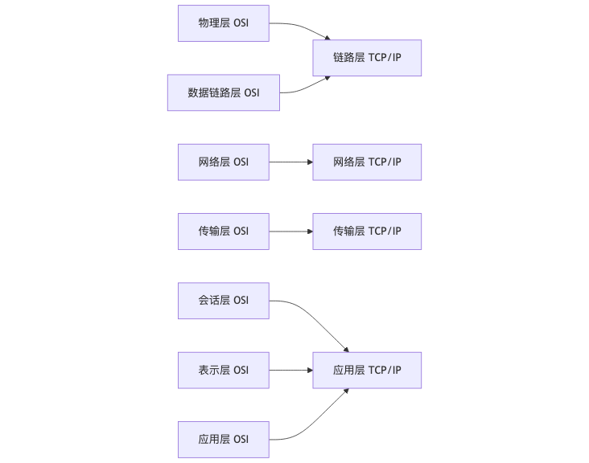

计算机网络基础概念---GESP教程Python二级

计算机网络基础概念
计算机网络的概念，计算机网络的分类，计算机网络的层级结构及作用，不同层级的重要协议，IP地址及子网掩码。

### 计算机网络的概念

计算机网络是指将多个计算机或设备通过网络物理介质连接起来，以实现信息和资源的共享。
它是一种基础设施，通过它可以实现对远程计算机系统、设备或资源的访问和控制。
计算机网络架设的目的是在不同的地理位置、设备与人之间建立信息交流或数据传输的通道和共享机制。

### 计算机网络的分类

按照联网的计算机之间的距离和网络覆盖面的不同，计算机网络一般分为广域网（WAN）、城域网（MAN）、局域网（LAN）和因特网（Internet）。

* **局域网（LAN）**：局域网相当于某厂、校的内部电话网，是由某种类型的电缆把计算机直接连在一起的网络。局域网是封闭型的，可以由办公室内的两台计算机组成，也可以由一个公司内的上千台计算机组成。
* **城域网（MAN）**：城域网是介于广域网和局域网之间的一种高速网络，其网络覆盖范围通常是一个城市，主要用来将一个城市内的多个局域网互连起来，形成一个大型的网络，并对该网络提供有效的路由。
* **广域网（WAN）**：广域网的功能是将地域上分散的计算机或局域网互连起来，构成一个大范围的数据通信网络。通常广域网的数据传输速率比局域网低，而信号的传播延迟却比局域网要大得多。广域网的典型应用是Internet。

### 计算机网络的层级结构及作用

计算机网络的层级结构主要包括``OSI七层模型``和``TCP/IP四层模型``。

* **OSI七层模型**

  * **物理层**: 物理层就是负责传输数据的线路，比如网线、光纤等。定义了传输数据的硬件标准，如网线的接口标准、传输速率等。
  * **数据链路层**：数据链路层就是负责将数据从一个地方传输到另一个地方。它负责将比特流组织成帧，进行差错检测和纠正，并提供流量控制。``帧``是数据链路层的基本单位，它包含了数据和控制信息。
  * **网络层**：网络层是在数据链路层的基础上，为数据包选择路由，将数据包从源主机传输到目的主机。它负责数据包的传输和路由选择。``数据包``是网络层的基本单位，它包含了数据和控制信息。
  * **传输层**：在数据层面上负责数据的传输，它负责数据的传输和路由选择。传输层的主要功能是提供端到端的通信服务，确保数据的可靠传输。
  * **会话层**：``会话``是指两个应用程序之间的通信会话。会话层的主要功能是建立、管理和终止会话，确保数据的可靠传输。
  * **表示层**：表示层负责数据的格式转换，确保数据的可靠传输。它负责数据的格式转换，确保数据的可靠传输。
  举例来说，表示层可以将数据转换为适合传输的格式，如将``图片``转换为``二进制数据``。
  * **应用层**：应用层是OSI参考模型的最高层，简单来说就是用户接口。应用层负责为用户提供各种服务，如``电子邮件``、``文件传输``、``远程登录``等。

* **TCP/IP四层模型**

TCP/IP模型因其开放性和易用性在实践中得到了广泛的应用，TCP/IP协议栈也成为互联网的主流协议。TCP/IP模型各个层次分别对应于不同的协议，包括：

* **网络接口层**：网络接口层对应OSI参考模型的物理层和数据链路层，它负责接收IP数据报并通过网络发送，或者从网络上接收物理帧，抽出IP数据报交给IP层。
* **网络层**：网络层对应OSI参考模型的网络层，它负责处理来自传输层的分组发送请求，将分组装入IP数据报，填充报头，选择路由等。网络层协议包括IP、ICMP、ARP、RARP等。
* **传输层**：传输层对应OSI参考模型的传输层，它提供端到端的通信服务。传输层协议主要有TCP和UDP两个协议，其中TCP提供可靠的面向连接的服务，而UDP则提供不可靠的面向无连接的服务。
* **应用层**：应用层对应OSI参考模型的应用层、表示层和会话层，它直接向用户提供服务，完成用户希望在网络上完成的各种工作。应用层协议包括HTTP、FTP、SMTP、DNS等。

### 不同层级的重要协议

* **物理层**：常用的协议有RS232、ADSL+、FTTx、RJ-45等。
* **数据链路层**：常用的协议有PPP、CSMA/CD、MAC、VLAN等。其中PPP协议是目前使用最广泛的点对点数据链路层协议，CSMA/CD协议是以太网中使用的协议。
* **网络层**：常用的协议有ICMP、OSPF、IP、RIP、BGP、IPv6、VPN、NAT等。其中IP协议是Internet中最重要的协议之一，它提供了不可靠、无连接的传送服务。
* **传输层**：常用的协议有TCP、UDP、ARQ、AQM等。其中TCP协议提供可靠的面向连接的服务，而UDP协议则提供不可靠的面向无连接的服务。
* **会话层、表示层、应用层**：这三层在TCP/IP模型中通常被合并为应用层。常用的协议有HTTP、WWW、DNS、FTP、TELNET、SMTP、DHCP、SNMP等。其中HTTP协议是Web应用的基础，DNS协议用于域名解析，FTP协议用于文件传输，SMTP协议用于邮件发送等。

### IP地址及子网掩码

IP地址是标识网络中不同主机的地址。  
IP地址分为IPv4和IPv6两种，IPv4地址由32位二进制数表示，IPv6地址由128位二进制数表示。  

子网掩码是用来划分网络地址和主机地址的掩码，它与IP地址一起使用 ，用来指示IP地址中哪些位是网络位，哪些位是主机位。
子网划分是通过借用IP地址的若干位主机位来充当子网地址，从而将原网络划分为若干个子网的过程。
子网划分可以提高网络的安全性、优化网络性能并简化网络管理。

**示例**

* IP地址：`192.168.1.1`
* 子网掩码：`255.255.255.0`
* 网络地址：`192.168.1.0`（通过逻辑AND操作得到）

这意味着，所有IP地址在`192.168.1.0`到`192.168.1.255`（包括两端）之间的设备，如果使用相同的子网掩码`255.255.255.0`，则它们都属于同一个子网，可以直接相互通信，而不需要通过路由器进行转发。
