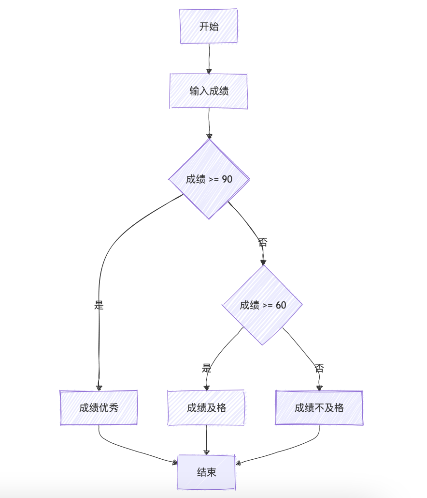
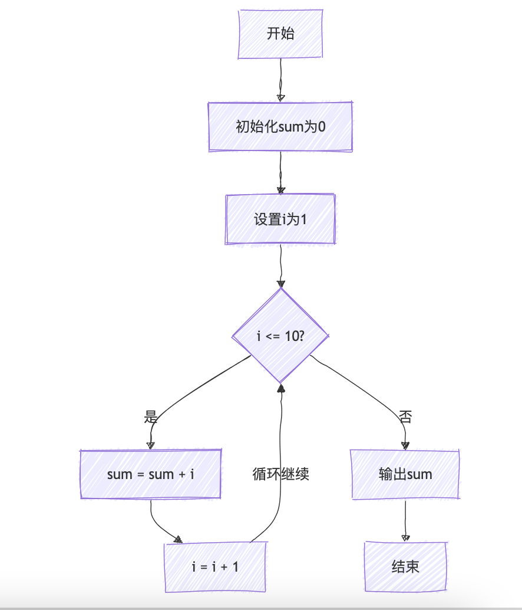

流程图的概念与描述---GESP教程Python二级

流程图的概念与描述
介绍流程图的基本概念和表示符号，掌握绘制流程图的方法，并举例判断流程图和循环流程图。

### 什么是流程图

``流程图``，简单来说，就是一种用图形方式来表示一系列步骤或操作过程的工具。它像是``一幅地图``，引导我们按照特定的路径或顺序来完成``一项任务``或``解决一个问题``。

想象一下，``你要做一个蛋糕``，你会按照一个食谱来做，这个食谱就是文字版的“流程图”。但如果你把这个食谱变成了一幅图画，每一步都用一个图形来表示，比如用圆形表示开始和结束，用矩形表示具体的操作步骤（比如“打鸡蛋”、“加面粉”等），用菱形表示需要做出判断的地方（比如“蛋糕熟了吗？”），然后用箭头把这些图形连接起来，形成一个清晰的路径，这就是一个流程图。

流程图的好处在于它``非常直观``，``一看就懂``，不需要阅读大量的文字。它可以帮助我们更好地理解一个过程，找出潜在的问题，优化流程，甚至与他人分享和沟通我们的想法。

在日常生活和工作中，流程图被广泛应用于各种领域，比如``软件开发``、``项目管理``、``生产制造``、``教育培训``等。无论你是想要设计一个新产品，还是想要组织一次活动，或者是想要学习一项新技能，都可以通过绘``制流程图``来帮助你更好地规划和执行。

所以，``流程图``就是一种用图形方式来表示和解释一系列步骤或操作过程的简单而有效的工具。

### 流程图的基本元素

流程图的基本元素主要包括以下几种，它们共同构成了流程图的框架，使得流程图能够清晰地展示某个过程或系统的操作步骤和逻辑关系：

1. **开始和结束符号**：
   - **开始符号**：通常是一个椭圆形，表示流程图的起点。
   - **结束符号**：也是一个椭圆形，但通常会标注“结束”字样，表示流程图的终点。
   > 注意：有的流程图制作工具中中的开始和结束符号也可能用其他形状，如圆形或矩形，比如Mermaid，但椭圆形是最常见的。

2. **处理（操作）符号**：
   - **矩形**：表示流程中的具体操作或步骤，如数据输入、数据处理、数据存储等。

3. **判断（决策）符号**：
   - **菱形**：用于表示流程中的判断或决策点，根据条件的不同，流程可能会选择不同的路径。

4. **输入输出符号**：
   - **平行四边形**：有时用于表示数据的输入或输出，但并非所有流程图都会严格区分这一点，输入输出操作也可能用矩形表示。

5. **流程线（连接线）**：
   - **箭头**：用于连接各个符号，表示流程的方向和顺序。箭头可以是有向的，也可以是无向的（但在流程图中通常是有向的），用于指示下一步的操作或决策。

6. **注释和说明**：
   - **文本框**：用于在流程图中添加额外的注释、说明或条件。这些注释可以帮助读者更好地理解流程图的含义和目的。

7. **其他辅助元素**：
   - **子流程**：当流程图的某个部分过于复杂时，可以将其拆分为一个子流程，用矩形或特定的子流程符号表示，并在主流程图中通过箭头指向该子流程。
   - **文档、数据库等**：有时会用特定的符号来表示流程中涉及的文档、数据库或其他资源。

### 流程图的简单事例

#### 1 成绩判断流程图

判断学生成绩是否及格的流程图如下：

#### 2 下面是累加1到10的循环流程图

