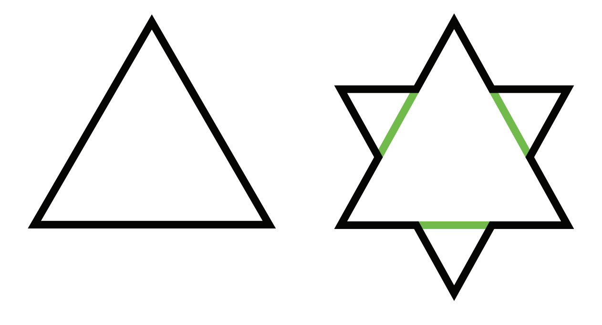
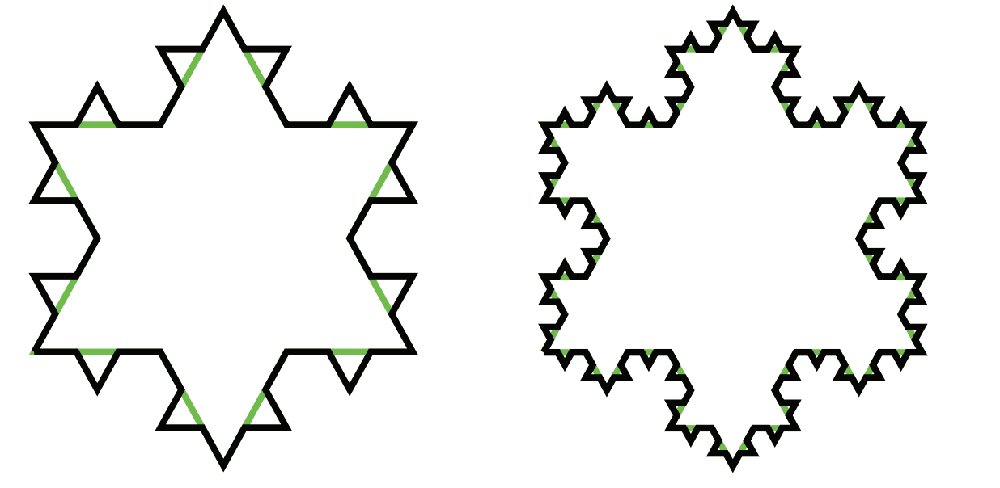
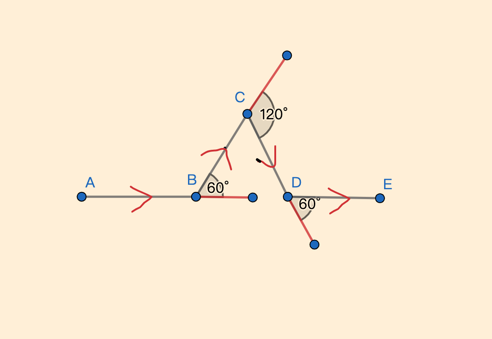
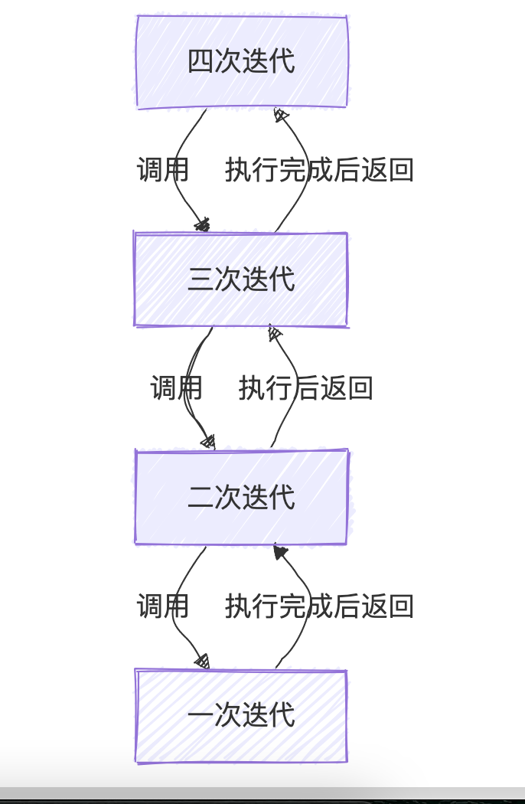
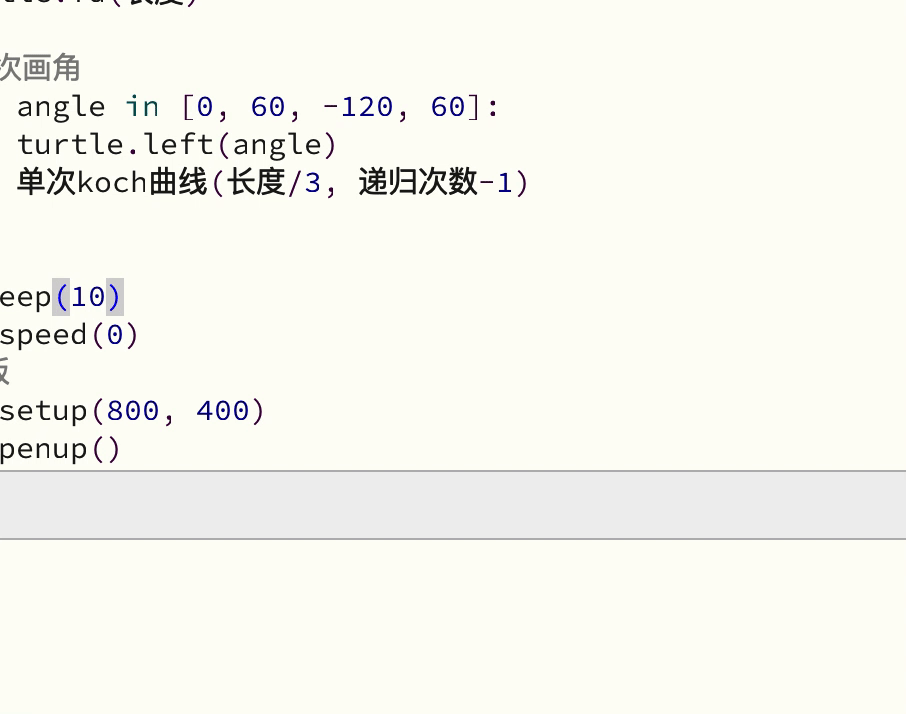

### 什么是科赫雪花

数学家科赫（Helge von Koch）提出的「科赫雪花」论，一片雪花的周长其实比地球的直径还要长。  

1904年，瑞典数学家科赫提出了一种几何学理论：将一个正三角形的每条边平分为三份，再以每条边中间的一份为「边」，向外做正三角形，这个过程称为「一次叠代」。（图一）


经过「一次叠代」，正三角形变为了12条边。我们再将每条边平分成三份，向外做更小的正三角形，称为「二次叠代」。  
然后不停地重复这个过程，直到无限次叠代，就形成了「科赫雪花」。（图二）



### 如何用Python Turtle绘制科赫雪花

通过观察科赫雪花的生成过程，我们可以发现，科赫雪花的生成过程是一个递归的过程。  
每一次的迭代是在上一次迭代的基础上进行的，对每一条边进行"画角"

#### 下面是单条边画角的过程分析



#### 下面是递归迭代的过程分析

我们可以将这个过程进行递归迭代，直到达到递归迭代的终止条件。
下面的流程图是分析四次迭代的过程：


### Python代码实现

```python
import turtle

def 单次koch曲线(长度, 递归次数):
    if 递归次数 == 0:
        turtle.fd(长度)
    else:
        #单次画角
        for angle in [0, 60, -120, 60]:
            turtle.left(angle)
            单次koch曲线(长度/3, 递归次数-1)

def main():
    #准备画板
    turtle.setup(800, 400)
    turtle.penup()
    turtle.goto(-100, 100)
    turtle.pendown()
    turtle.pensize(2)
    #初始化递归次数
    递归次数 = 3
    单次koch曲线(300, 递归次数)
    #三角形第一条边
    turtle.right(120)
    #三角形第二条边
    单次koch曲线(300, 递归次数)
    turtle.right(120)
    #三角形第三条边
    单次koch曲线(300, 递归次数)
    turtle.hideturtle()
    turtle.done()

if __name__ == '__main__':
    main()
```

下面是运行的效果图：

