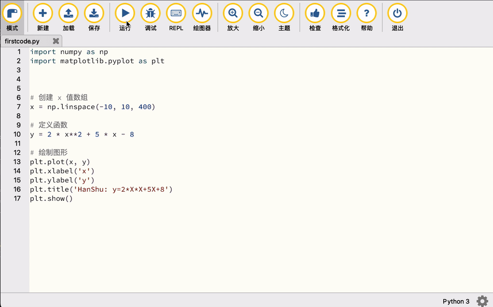

### Python 画一元二次函数的图形
>
>Python 寥寥数行代码，就可以画一元二次函数的图形,当然稍微调整一下还可以画
其他的函数图形。简单方便，利于对数学的直观理解。

>**(前提准备工作)在Mu Python 中添加 matplotlib 模块**

1. 点击【Mu Python界面】中，右下角的设置按钮
2. 弹出【设置】窗口，点击【第三方包】选项卡 ，在输入框中输入 matplotlib，点击【OK】按钮
3. 等待安装完成，安装完成后，点击【OK】按钮关闭【设置】窗口


编写代码

``` python
# 导入模块

import numpy as np # 导入numpy模块 ，数学计算库
import matplotlib.pyplot as plt  #绘图库

# 创建 x 值数组

x = np.linspace(-10, 10, 400)

# 定义函数

y = 2 *x**2 + 5* x - 8

# 绘制图形

plt.plot(x, y)  # 绘制图形
plt.xlabel('x') # x,y轴标签
plt.ylabel('y') # x,y轴标签
plt.title('HanShu: y=2*X*X+5X+8') # 标题
plt.show() # 显示图形

```

运行结果
点击【运行】按钮，运行结果如下图所示：


结果说明：

1. 鼠标可以点击图形上的点，显示该点对应的函数(x,y)值
2. 可以对函数进行调整:
比如：y = 2 *x2 + 5* x - 8，  

可以调整为 y = 2 *x2 + 5* x - 8 + 10，  

完成函数调整后，点击【**停止**】按钮后，再次点击【**运行**】按钮，就可以重新生成新的函数图形了。
