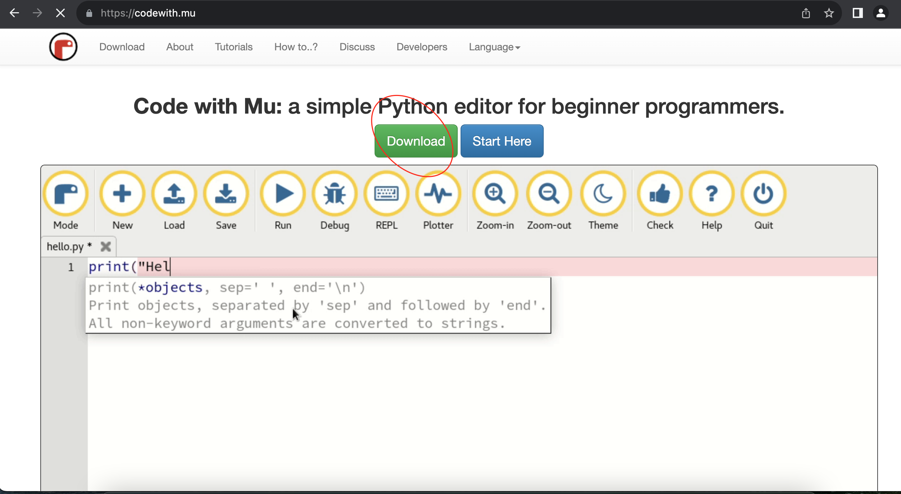
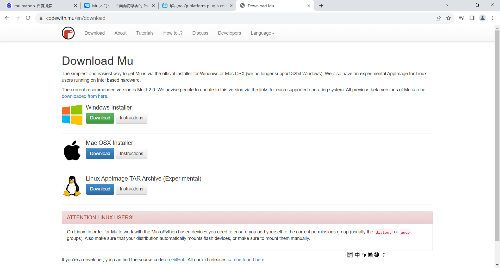
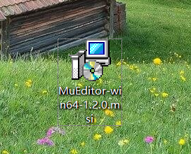
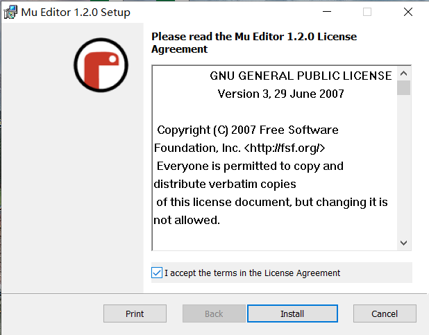
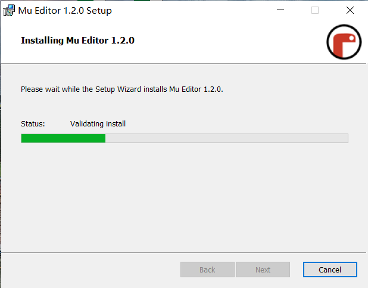
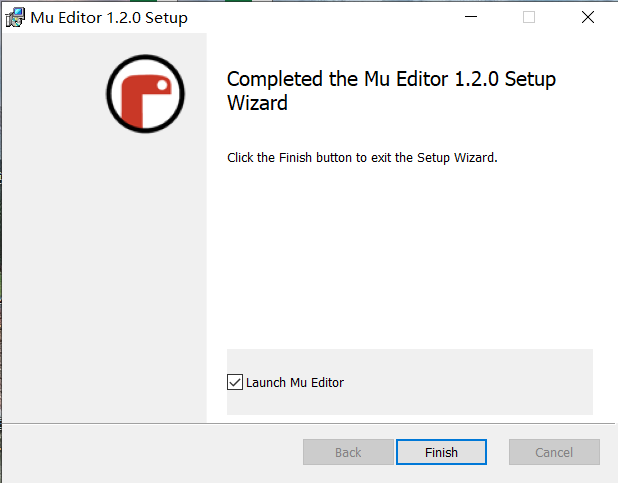

## 安装 mupython 的步骤如下： 
1. 打开浏览器，访问 mupython 的官方网站（https://mupython.com/）。     
在官网首页找到并点击 \"Download\" 按钮 。 

2. 在下载页面中，你可以选择适合自己操作系统的安装包进行下载。mupython 支持 Windows、macOS 和 Linux 系统。

3. 下载完成后，双击运行安装包进行安装。  
  
   
4. 根据系统的不同，安装过程可能会有所不同。按照安装向导的指示，选择安装路径和其他设置。一般情况下，一路点next就行
      

    
5. 安装的最后一步 点击\"Finish\" 完成安装。
   
  