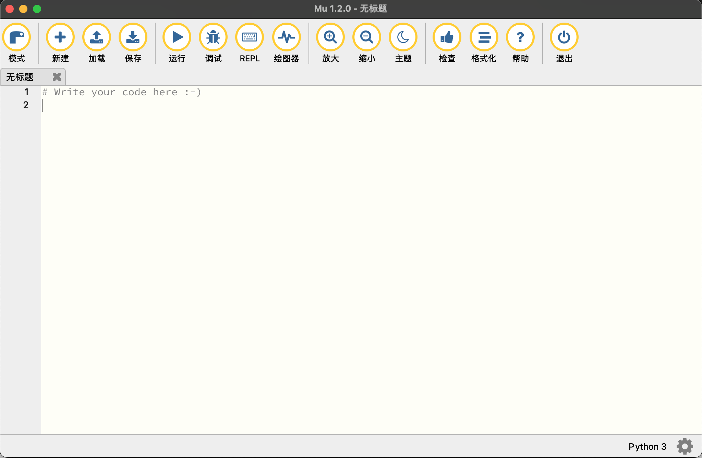
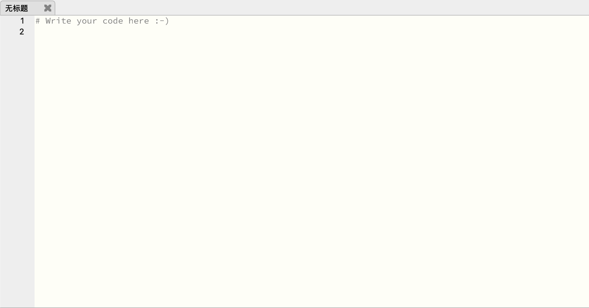
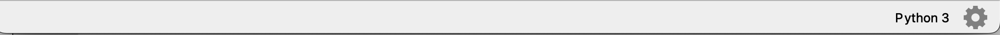

## MuPython界面介绍  

```  
Mu是面向初级程序员的Python代码编辑器。这意味着当你学习Python编码时，Mu可以非常轻松地创建、运行和修改你的Python程序。Mu的界面非常简单，没有复杂的功能，因此你不会被复杂的界面吓倒。 Mu的界面分为四个部分：标题栏、按钮栏、编码区和状态栏。这四个部分的功能都非常简单，因此学习起来很容易。  
```
 
Mu非常简单易懂。以下是它的样子：



### 1 标题栏 


标题栏显示了Mu的版本号和当前打开的文件的名称。
* 如果你没有打开任何文件，标题栏将显示“Mu Editor”。
* 如果你打开了一个文件，标题栏将显示文件的名称。
* 如果你对Mu的版本感兴趣，你可以点击标题栏，然后点击“关于Mu”按钮，这将打开一个新的窗口，显示Mu的版本号和一些其他信息。

### 2 按钮栏

如您所见，它包含圆形按钮。如果您将鼠标悬停在按钮上（没有实际单击它），您将在按钮上看到一个小工具提示弹出，其中包含有关该按钮的作用的更多信息。试试吧！  

>大多数按钮保持不变，但有些按钮会根据您当时正在做什么而改变。

这些按钮被组合在一起：
#### 2.1 模式：
这个按钮非常重要，它进入自己的组中。点击它更改Mu的当前模式。每种模式都有不同的功能，这取决于你想要实现什么。 
Mu的模式简单的讲就是开发类型，比如说【Python 3】,单片机【BBC micro:bit】【ESP板上的MicroPython】等，具体的可以看后面章节关于模式的详细介绍。

#### 2.2 文件系统：
文件系统：此组中的“新建”、“加载”和“保存”按钮允许您与计算机硬盘驱动器上的文件进行交互。
* 新建：创建一个新的空白文件。
* 加载：打开文件选择器以选择要加载到Mu中的文件。
* 保存：将文件保存到计算机的硬盘驱动器。如果文件没有名字，你会被要求给出一个。如果文件有名称，它们通常每5秒自动保存一次。

#### 2.3 代码操作
代码操作：下一组按钮可能会发生变化，具体取决于您当前使用的模式。它们为您提供了与您编写的代码交互的有趣方式。在上面的示例中，“运行”、“调试”、“REPL”和“绘图仪”按钮是该组的一部分。每个模式的按钮在每个单独模式的教程中都有描述。

#### 2.4 显示设置
显示设置：有时改变Mu的外观很重要。接下来的三个按钮（“缩放”、“缩放”和“主题”）改变了Mu的呈现方式。  
“放大”和“缩小”按钮使文本变大或变小。如果您在查看代码时需要帮助，这非常有用。

“主题”按钮在三个不同的显示“主题”中切换：
*  白天：一个易于眼睛的浅色主题（用于示例图像）。
*  夜晚：一个黑暗的主题，让你看起来像好莱坞电影中的程序员。
*  高对比度：适合那些需要帮助查看Mu用户界面的人的黑白主题。
>Mu记得你重新启动编辑器时上次使用的是哪个主题。

#### 2.5 编辑支持
编辑支持：“检查”、“帮助”和“退出”按钮为Mu提供了帮助您使用Mu的方法。
* 检查：分析您的代码并提出改进方法。
* 帮助：在Mu的帮助页面上打开您的默认浏览器。
* 退出：停止编辑器。如果你还没有这样做，你可能会被要求保存你的工作。

### 3 编码区


按钮区下方是“选项卡”，显示您打开的文件，并突出显示您当前正在处理的文件：  
1. 单击选项卡以更改为选项卡中命名的文件。  
2. 要关闭文件，只需单击文件选项卡中的十字。您还可以单击并拖动选项卡从左到右，然后再拖動它们，以重新排序它们。  
3. 如果您想重命名文件，请在选项卡中双击其名称，系统会要求您提供新名称。

在选项卡下面是Mu最大和最重要的部分~文本编辑器：  
1. 这会显示当前所选选项卡的代码。
2. 当您更改选项卡时，您将看到此区域中的代码发生变化。
3. 如果您单击此区域并开始键入，您将看到您的代码显示在这里。
4. 当您键入代码时，Mu将更改文本的颜色，以帮助您阅读代码。
5. 左侧是一列包含您文件的行号。当Python报告错误（通常包含行号）时，这些非常有用。
 
### 4 状态栏

页脚包含三样东西：
* 左边是Mu给你写信的区域。在这种情况下，Mu在说：“万岁！检查器出现没有问题”。
* 右边的第一个项目是当前模式的名称。在这种情况下，Mu处于Python模式。
* 最右侧的物品是一个齿轮物品。如果您单击它，您将看到一个管理屏幕，在大多数情况下，您可以安全地忽略该屏幕。