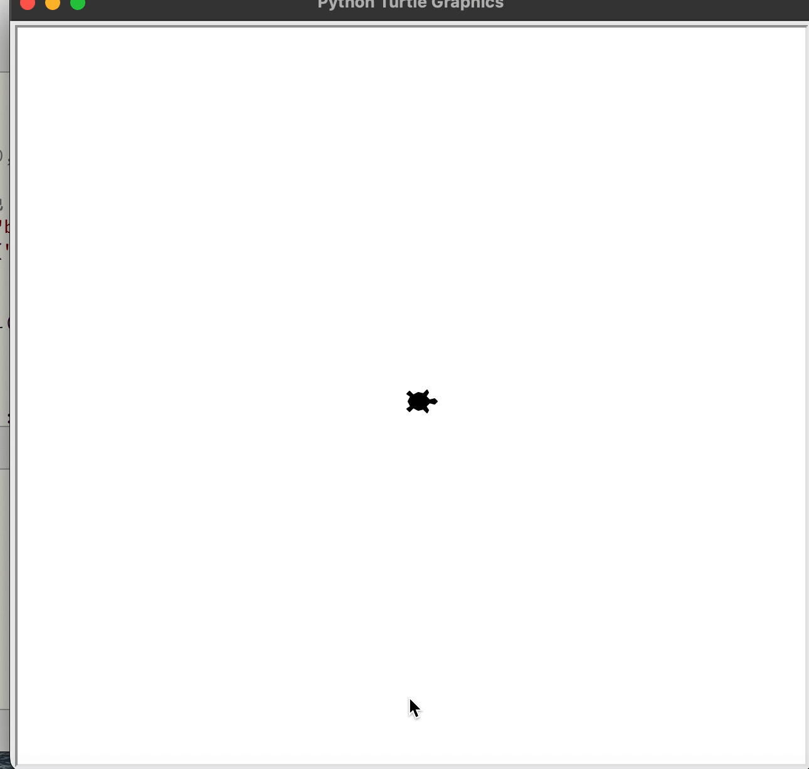

turtle库是Python语言中自带的一个用于绘制图像的函数库。turtle库为使用者提供一个或多个小乌龟作为画笔，使用者可通过turtle库提供的各种方法去控制小乌龟在一个平面直角坐标系中移动并绘制移动轨迹以画出想要的图案。  
Python的turtle库非常适合初学者学习和使用。以下是一个关于turtle模块的初级教程。

### 1. 导入turtle模块

turtle模块是Python的一个标准库，用于绘制图形。在使用前不需要进行安装。

在Python中，使用turtle模块之前需要先导入它。

* **从turtle模块中导入所有内容**

```python
from turtle import *
```

使用这种方式，你可以直接使用turtle模块中的所有函数和属性，无需前缀。

### 2. 设置画布

你可以使用`setup()`函数来设置画布的大小和位置。例如：

```python
turtle.setup(width=800, height=600)  # 设置画布宽度为800像素，高度为600像素
```

### 3. 控制画笔

turtle模块提供了许多用于控制画笔的函数，如设置画笔颜色、宽度、移动速度等。

* **设置画笔颜色**：`pencolor(color)`
  red:红色, green:绿色, blue:蓝色, yellow:黄色, cyan:青色, magenta:品红色, black:黑色, white:白色, purple:紫色, orange:橙色, brown:棕色, gray:灰色, pink:粉色, lightblue:浅蓝色, darkblue:深蓝色, lightgreen:浅绿色, darkgreen:深绿色, navy:藏青色, olive:橄榄色, teal:蓝绿色, maroon:栗色, lime:青柠檬色, aqua:水绿色, fuchsia:紫红色, indigo:靛蓝色, silver:银色, gold:金色

* **设置画笔宽度**：`width(size)`
* **设置画笔速度**：`speed(speed)`，其中speed的值在0（最慢）到10（最快）之间。

例如：

```python
turtle.pencolor("red")  # 设置画笔颜色为红色
turtle.width(5)         # 设置画笔宽度为5像素
turtle.speed(4)         # 设置画笔速度为4
```

### 4. 移动画笔

turtle模块提供了多种移动画笔的函数。

* **前进**：`forward(distance)` 或 `fd(distance)`
* **后退**：`backward(distance)` 或 `bk(distance)` 或 `back(distance)`
* **转向**：`left(angle)` 和 `right(angle)`，其中angle是转动的角度（以度为单位）。
* **移动到指定位置**：`goto(x, y)` 或 `setpos(x, y)` 或 `setposition(x, y)`

例如：

```python
turtle.forward(100)  # 画笔前进100像素
turtle.left(90)      # 画笔左转90度
turtle.goto(0, 0)    # 将画笔移动到坐标原点
turtle.left(45)      # 画笔左转45度
```

### 5. 绘制图形

使用turtle模块，你可以绘制各种图形，如正方形、圆形、多边形等。

* **绘制正方形**：通过结合前进和转向命令。
* **绘制圆形**：使用`circle(radius, extent=None)`函数，其中radius是圆的半径，extent是绘制的角度（默认为360度）。

例如，绘制一个边长为100像素的正方形：

```python
for i in range(4):
    turtle.forward(100)
    turtle.right(90)
```
例如，绘制一个半径为50像素的圆：

```python
turtle.circle(50)
```

### 6. 填充颜色

turtle模块还允许你为绘制的图形填充颜色。

* **设置填充颜色**：`fillcolor(color)`
* **开始填充**：`begin_fill()`
* **结束填充**：`end_fill()`

### 7. 隐藏画笔

如果你不想在画布上显示画笔（即小海龟），可以使用`hideturtle()`函数。

### 8. 保持画布显示

在程序结束时，使用`done()`函数可以保持画布窗口打开，直到用户关闭它。

### 9. 示例程序

以下是一个简单的示例程序，它绘制了一个填充了红色的正方形：

```python
import turtle
#设置画笔为小乌龟形状
turtle.shape("turtle") 

# 设置画布
turtle.setup(400, 400)

# 设置画笔和填充颜色
turtle.pencolor("black")
turtle.fillcolor("red")

# 开始填充
turtle.begin_fill()

# 绘制正方形
for _ in range(4):
    turtle.forward(100)
    turtle.right(90)

# 结束填充
turtle.end_fill()

# 隐藏画笔
turtle.hideturtle()

# 保持画布显示
turtle.done()
```

运行此程序将绘制一个红色的正方形。

