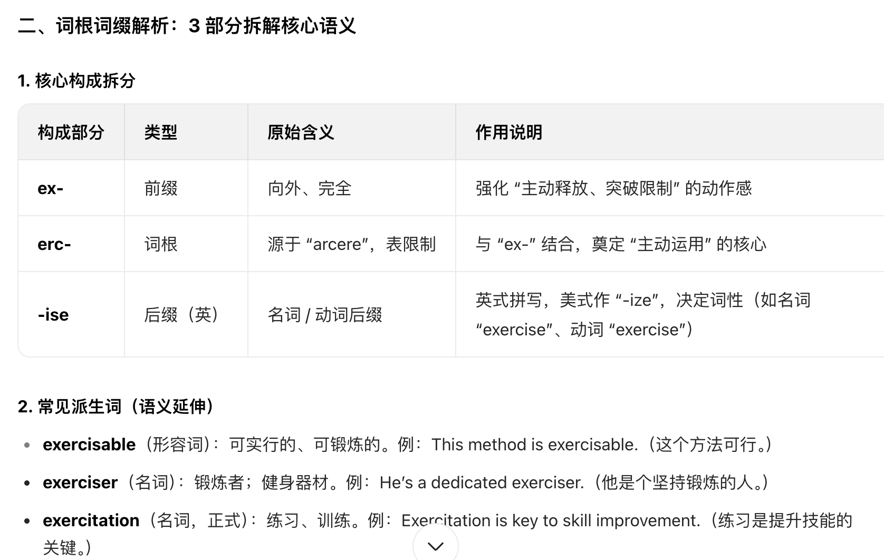

AI改变学习2 -->词根词缀+联想记忆法让背单词更轻松更有效，彻底告别死记硬背。

**死记硬背单词**，会出现记忆效率差，时间长了会遗忘等难题。想用专门的**单词记忆书**，但市面上大多是按字母顺序编排的，缺乏系统性和逻辑性，记忆效果不佳。   
**生成式AI** 可以帮助我们解决这些问题，通过词根词缀法和联想记忆法，让背单词变得更轻松、更有效。  


### 准备工作 AI工具
我们当前使用的生成式AI工具是豆包
1. 豆包安装
两种安装方式 
* 第一种手机市场中搜索**豆包**下载安装  
* 第二种到官网www.doubao.com下载桌面版本


### 一、词根词缀记忆法（单词的基础）

**单词的演变** 
单词的演变是指单词在历史发展过程中，其形式和意义发生的变化。通过了解单词的演变，我们可以更好地理解单词的含义和用法，从而更有效地记忆单词。

**词根词缀法**是一种通过分析单词的构成部分来帮助记忆和理解单词的方法。我们在学习单词时，可以将单词拆分为词根、前缀和后缀等部分，理解每个部分的含义和作用，从而更容易记住单词的意思和拼写。


#### 1.1 根词缀法的AI提示词
``` text
Excercise 单词的演变 和 词根词缀
```
>在生成之前，选择**深度思考**模式，这样生成的结果会更好。

#### 1.2 AI生成的词根词缀分析结果




### 二、联想记忆法

**联想记忆法**是一种通过将新信息与已有知识建立联系来帮助记忆的方法。在学习单词时，我们可以通过联想词义、词形、词音等方面的相似性，来加深对单词的理解和记忆。
#### 2.1 联想记忆法的AI提示词
``` text
Excercise   谐音联想记忆

```

#### 2.2 AI生成的联想记忆结果

