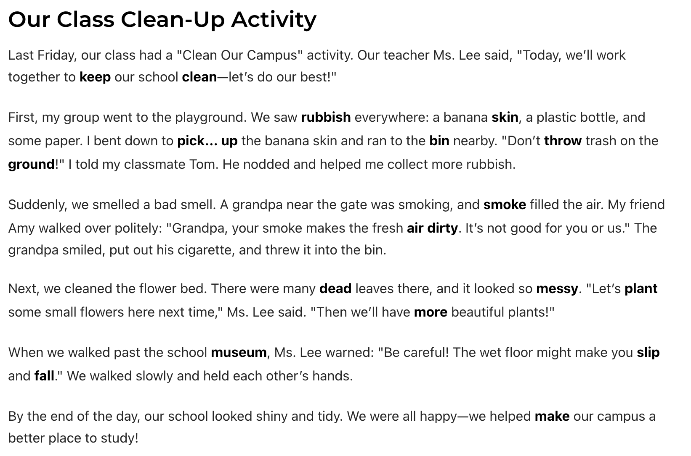
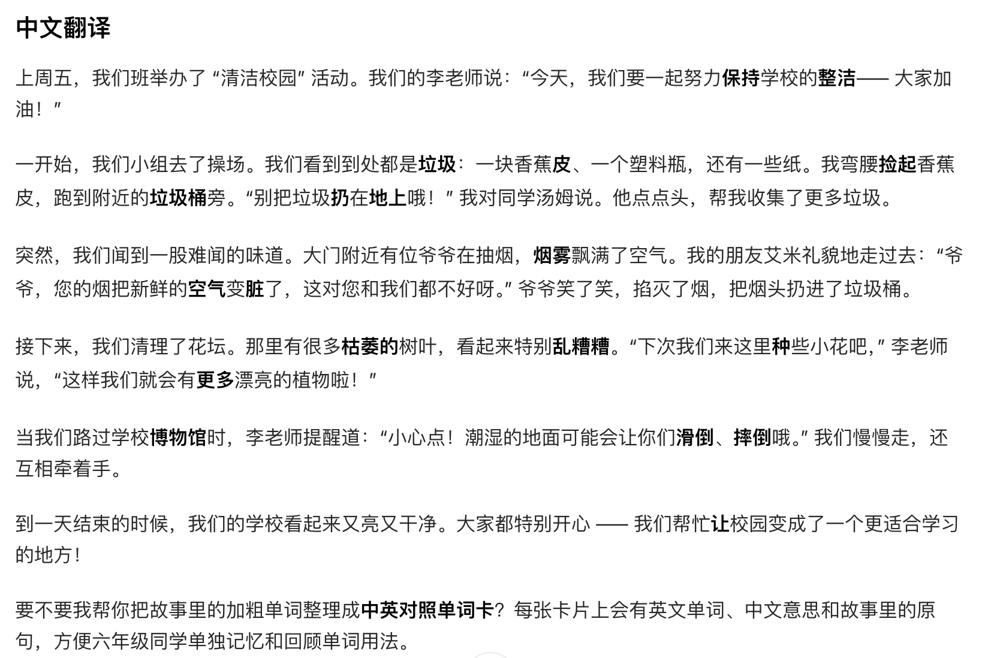

 
AI改变学习3 --> 革命性沉浸式语境记忆法！AI 编故事背单词：语境记词更轻松，真正学会不遗忘

### 1 传统的背单词的困扰
* **逐个**背诵单词，时间长了**容易遗忘**
* 缺乏语境，**难以理解和记忆**单词的用法
* 记忆**效率低**，学习效果不佳

### 2生成式AI，带来革命性的背单词的方法（沉浸式语境记忆法）
#### 2.1沉浸式语境记忆法
先选择**一组单词**，通过**指定场景**，让**AI**生成一个**有趣的故事**，将这些单词融入其中。通过**故事情节和人物对话**，帮助我们在语境中理解和记忆单词的含义和用法。  

#### 2.2 这样背诵单词的优势

1. **提高记忆效率**：通过故事情节和人物对话，帮助我们在语境中理解和记忆单词的含义和用法，从而提高记忆效率。
2. **增强学习兴趣**：有趣的故事情节和人物对话能够吸引我们的注意力，增强学习兴趣，提高学习动力。
3. **促进主动学习**：通过参与故事情节的构建，我们能够更主动地思考和运用所学单词，促进主动学习。

### 3 沉浸式语境记忆法的应用

#### 3.0 准备工作 AI工具
我们当前使用的生成式AI工具是豆包
1. **豆包安装**
两种安装方式 
* 第一种手机市场中搜索**豆包**下载安装  
* 第二种到官网www.doubao.com下载桌面版本

#### 3.1 沉浸式语境记忆法的AI提示词
**下面举例是小学六年级上学期第六单词的生词清单**
``` text
将下列【keep clean make air dirty smoke rubbish messy dead bin plant more museum throw skin ground pick... up slip fall】单词 编写一个小学六年级可以看懂的 大概300-400百字的英文有趣的故事，
注意这些单词加粗区分，
同时故事的下面，添加一段对应的中文翻译
```

#### 3.2 AI生成的沉浸式语境记忆法结果

