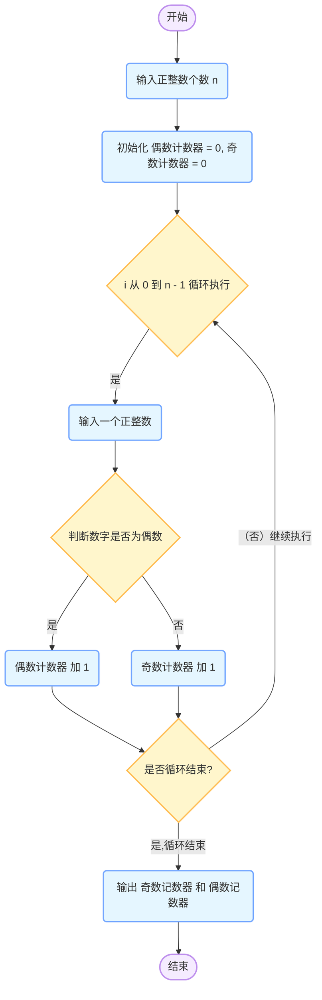

Python模拟投掷硬币实验：验证投掷次数增加时，正面出现概率趋近于1/2

### Python模拟投掷硬币实验教程：验证投掷次数增加时，正面出现概率趋近于1/2

### 一、实验背景与目的

投掷硬币是一个经典的随机事件，其理论上的正面和反面出现概率均为1/2。  
本实验旨在通过Python模拟投掷硬币的过程，观察并记录不同投掷次数下正面出现的概率，以验证随着投掷次数的增加，正面出现的概率是否趋近于**1/2**。

### 二、实验步骤

#### 1. **定义投掷函数**

   定义一个函数`coin_Toss`，它接受投掷次数作为参数，并返回正面出现的次数。

   ```python
   import random
   def coin_toss(times):
      #正面朝上的次数
      headUpCount=0
      #循环投掷硬币，每次通过随机数生成0或1来模拟正反面 0表示反面，1表示正面
      for i in range(times):
          #随机生成0或1，0表示反面，1表示正面
          if random.randint(0,1)==1:
              headUpCount+=1
      return headUpCount
       
   ```

#### 2. **选取投掷次数**

   对于不同的投掷次数，重复进行投掷实验，并记录正面出现的次数。  
   **准备的次数**包括10次，100次，1000次，5000次，10000次，10w次等  
   每次完成模拟实现后,计算**正面的概率**

   ```python
   from decimal import Decimal, getcontext

   import random
   import math
   # 准备的次数
   num_up_10 = coin_toss(10)
   up_rate=num_up_10/10
   print(f"投掷10次，正面出现次数:{num_up_10}, 正面出现的概率为：{up_rate} 误差：{abs(up_rate-Decimal(0.5))}")

   num_up_100 = coin_toss(100)
   up_rate=num_up_100/100
   print(f"投掷100次，正面出现次数:{num_up_100},正面出现的概率为：{up_rate} 误差：{abs(up_rate-Decimal(0.5))}")

   num_up_1000 = coin_toss(1000)
   up_rate=num_up_1000/1000
   print(f"投掷1000次，正面出现次数:{num_up_1000},正面出现的概率为：{up_rate} 误差：{abs(up_rate-Decimal(0.5))}")

   num_up_5000 = coin_toss(5000)
   up_rate=num_up_5000/5000
   print(f"投掷5000次，正面出现次数:{num_up_5000},正面出现的概率为：{up_rate} 误差：{abs(up_rate-Decimal(0.5))}")

   num_up_10000 = coin_toss(10000)
   up_rate=num_up_10000/10000
   print(f"投掷10000次，正面出现次数:{num_up_10000},正面出现的概率为：{up_rate} 误差：{abs(up_rate-Decimal(0.5))}")

   num_up_100000 = coin_toss(100000)
   up_rate=num_up_100000/100000
   print(f"投掷100000次，正面出现次数:{num_up_100000},正面出现的概率为：{up_rate} 误差：{abs(up_rate-Decimal(0.5))}")

```

> 补充说明Decimal是python的一个模块，用于处理浮点数的精度问题，可以避免浮点数运算时出现的精度误差。

#### 3. **运行代码,获取数据**

   运行上述代码，观察不同投掷次数下正面出现的概率，并记录实验结果。

   **第一次运行结果**  

   ``` text
投掷10次，正面出现次数:6, 正面出现的概率为：0.6 误差：0.1
投掷100次，正面出现次数:52,正面出现的概率为：0.52 误差：0.02
投掷1000次，正面出现次数:509,正面出现的概率为：0.509 误差：0.009
投掷5000次，正面出现次数:2507,正面出现的概率为：0.5014 误差：0.0014
投掷10000次，正面出现次数:4981,正面出现的概率为：0.4981 误差：0.0019
投掷100000次，正面出现次数:50248,正面出现的概率为：0.50248 误差：0.00248
   ```

   **第二次运行结果**

   ``` text
投掷10次，正面出现次数:4, 正面出现的概率为：0.4 误差：0.1
投掷100次，正面出现次数:45,正面出现的概率为：0.45 误差：0.05
投掷1000次，正面出现次数:510,正面出现的概率为：0.51 误差：0.01
投掷5000次，正面出现次数:2553,正面出现的概率为：0.5106 误差：0.0106
投掷10000次，正面出现次数:4988,正面出现的概率为：0.4988 误差：0.0012
投掷100000次，正面出现次数:50043,正面出现的概率为：0.50043 误差：0.00043
   ```

   **第三次运行结果**

   ``` text
投掷10次，正面出现次数:7, 正面出现的概率为：0.7 误差：0.2
投掷100次，正面出现次数:60,正面出现的概率为：0.6 误差：0.1
投掷1000次，正面出现次数:502,正面出现的概率为：0.502 误差：0.002
投掷5000次，正面出现次数:2518,正面出现的概率为：0.5036 误差：0.0036
投掷10000次，正面出现次数:5010,正面出现的概率为：0.501 误差：0.001
投掷100000次，正面出现次数:50172,正面出现的概率为：0.50172 误差：0.00172
   ```

#### 三、实验结果与分析

根据上面的两次运行结果，我们可以看到，随着投掷次数的增加，正面出现的概率逐渐趋近于1/2。  
尽管在每次实验中，正面出现的概率可能会有一定的偏差，但随着投掷次数的增加，这种偏差会逐渐减小，最终趋于理论值1/2。

#### 四、结论

本实验通过Python模拟投掷硬币的过程，验证了随着投掷次数的增加，正面出现的概率趋近于1/2的理论预测。  
这不仅加深了我们对概率论的理解，还展示了Python在数据处理和可视化方面的强大功能。

